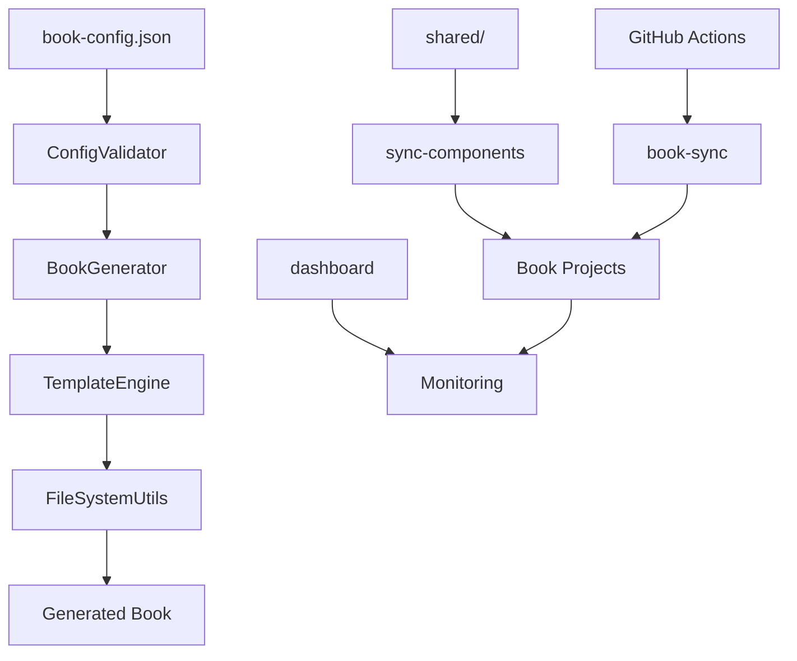

# Book Formatter アーキテクチャ

## 概要

Book Formatter は、設定駆動型の書籍生成システムと継続的改善システムを統合した、包括的な書籍管理プラットフォームです。

## システム構成

```
book-formatter/
├── src/                      # コアモジュール
│   ├── index.js             # CLI エントリーポイント
│   ├── BookGenerator.js     # 書籍生成エンジン
│   ├── ConfigValidator.js   # 設定検証
│   ├── TemplateEngine.js    # テンプレート処理
│   └── FileSystemUtils.js   # ファイル操作
├── scripts/                  # 管理ツール
│   ├── check-links.js       # リンクチェッカー
│   ├── dashboard.js         # 監視ダッシュボード
│   └── sync-components.js   # コンポーネント同期
├── shared/                   # 共通コンポーネント
│   ├── schemas/             # 設定スキーマ
│   └── version.json         # バージョン管理
├── .github/workflows/        # CI/CD
│   ├── book-sync.yml        # 書籍同期
│   └── quality-check.yml    # 品質チェック
└── tests/                    # テストスイート
```

## コアコンポーネント

### 1. BookGenerator

書籍の作成と更新を担当するメインエンジン。

**主な機能:**
- 設定ファイルからの書籍生成
- 既存書籍の構造更新
- テンプレートベースのファイル生成

**使用例:**
```javascript
const generator = new BookGenerator();
await generator.createBook('book-config.json', './output');
```

### 2. ConfigValidator

設定ファイルの検証とスキーマ準拠の確認。

**検証項目:**
- 必須フィールドの確認
- データ型の検証
- 構造の整合性チェック

### 3. TemplateEngine

Handlebars風の簡易テンプレートエンジン。

**サポート機能:**
- 変数展開: `{{variable}}`
- 条件分岐: `{{#if condition}}...{{/if}}`
- 繰り返し: `{{#each array}}...{{/each}}`

### 4. FileSystemUtils

安全なファイル操作のためのユーティリティ。

**機能:**
- 原子的なファイル書き込み
- 自動バックアップ
- ディレクトリトラバーサル対策

## 品質保証システム

### リンクチェッカー

Markdownファイル内のリンクを検証。

```bash
npm run check-links -- --output report.json
```

**検証内容:**
- 内部リンクの存在確認
- アンカーの検証
- 外部リンクのオプション検証

### 監視ダッシュボード

組織内の全書籍プロジェクトを監視。

```bash
npm run dashboard:watch
```

**監視項目:**
- GitHub Pages状態
- ワークフロー実行状況
- 更新頻度
- エラー状態

## CI/CDパイプライン

### book-sync.yml

共通コンポーネントの変更を全書籍に自動反映。

**トリガー:**
- `src/`, `templates/`, `shared/` の変更
- 手動実行

**動作:**
1. 対象書籍の検出
2. book-formatter による更新
3. プルリクエストの作成

### quality-check.yml

コード品質と書籍生成の検証。

**チェック項目:**
- ESLint による静的解析
- テストスイートの実行
- テンプレート検証
- 書籍生成テスト
- セキュリティスキャン

## データフロー



## セキュリティ考慮事項

1. **入力検証**
   - すべての設定ファイルはスキーマに対して検証
   - パストラバーサルの防止

2. **ファイル操作**
   - 原子的な書き込みによるデータ整合性保証
   - 自動バックアップによる復旧可能性

3. **CI/CD**
   - 最小権限の原則
   - シークレットの適切な管理

## パフォーマンス最適化

1. **並列処理**
   - 複数書籍の同時処理
   - 非同期I/O操作

2. **キャッシング**
   - テンプレートのメモリキャッシュ
   - 設定ファイルの再利用

3. **インクリメンタル更新**
   - 変更されたファイルのみ更新
   - 差分検出による効率化

## 拡張ポイント

1. **新しい出力形式**
   - `TemplateEngine` にテンプレート追加
   - `BookGenerator` に生成ロジック追加

2. **カスタムバリデーション**
   - `ConfigValidator` にルール追加
   - スキーマの拡張

3. **追加ツール**
   - `scripts/` に新規ツール配置
   - npmスクリプトで統合

## 今後の展望

- PDF/EPUB生成機能
- 多言語対応の強化
- プラグインシステム
- Web UIダッシュボード