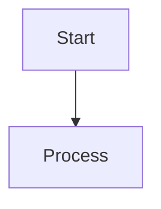

# Book Formatter トラブルシューティングガイド

このドキュメントは、Book Publishing Template v3.0を使用して書籍を生成・公開する際に遭遇する可能性のある問題と解決方法をまとめたものです。

## 目次

1. [GitHub Pages関連の問題](#github-pages関連の問題)
2. [ナビゲーション関連の問題](#ナビゲーション関連の問題)
3. [JavaScript関連の問題](#javascript関連の問題)
4. [レイアウト・デザイン関連の問題](#レイアウトデザイン関連の問題)
5. [設定ファイル関連の問題](#設定ファイル関連の問題)
6. [Jekyll Collections・テンプレート関連の問題](#jekyll-collectionsテンプレート関連の問題)
7. [Markdown記法・コードブロック関連の問題](#markdown記法コードブロック関連の問題)
8. [パフォーマンス最適化とコンテンツ保護の原則](#パフォーマンス最適化とコンテンツ保護の原則)

## GitHub Pages関連の問題

### 問題: ページが表示されない、404エラーになる

**原因**: 
- GitHub Pagesの設定が正しくない
- ビルドタイプが不適切
- パスの設定ミス

**解決方法**:
1. GitHub Pagesの設定を確認
```bash
gh api repos/[owner]/[repo]/pages --jq '{status, html_url, source, build_type}'
```

2. ビルドタイプを`workflow`に変更（推奨）
```bash
gh api -X PUT repos/[owner]/[repo]/pages --field build_type=workflow
```

3. GitHub Actions workflowファイルを追加
```yaml
# .github/workflows/pages.yml
name: Deploy Jekyll with GitHub Pages dependencies preinstalled

on:
  push:
    branches: ["main"]
  workflow_dispatch:

permissions:
  contents: read
  pages: write
  id-token: write

concurrency:
  group: "pages"
  cancel-in-progress: false

jobs:
  build:
    runs-on: ubuntu-latest
    steps:
      - name: Checkout
        uses: actions/checkout@v4
      - name: Setup Pages
        uses: actions/configure-pages@v5
      - name: Build with Jekyll
        uses: actions/jekyll-build-pages@v1
        with:
          source: ./
          destination: ./_site
      - name: Upload artifact
        uses: actions/upload-pages-artifact@v3

  deploy:
    environment:
      name: github-pages
      url: ${{ steps.deployment.outputs.page_url }}
    runs-on: ubuntu-latest
    needs: build
    steps:
      - name: Deploy to GitHub Pages
        id: deployment
        uses: actions/deploy-pages@v4
```

### 問題: ビルドは成功するが、最新の変更が反映されない

**原因**: ブラウザキャッシュ

**解決方法**:
- ブラウザキャッシュをクリア（Ctrl+Shift+Delete）
- ハードリフレッシュ（Ctrl+F5 または Cmd+Shift+R）
- シークレット/プライベートブラウジングで確認

## ナビゲーション関連の問題

### 問題: サイドバーナビゲーションが表示されない

**原因**: 
- レイアウトファイルが正しく設定されていない
- _config.ymlの構造設定が不足

**解決方法**:

1. _config.ymlに`structure`セクションを追加（ただし、動的に生成される場合は不要）
2. sidebar-nav.htmlを静的なリンクに変更

```html
<!-- _includes/sidebar-nav.html の例 -->
<div class="toc-section">
    <h4 class="toc-section-title">本編</h4>
    <ul class="toc-list">
        <li class="toc-item toc-chapter">
            <a href="{{ '/src/chapter-1/index.html' | relative_url }}" class="toc-link">
                <span class="chapter-number">第1章</span>
                <span class="chapter-title">タイトル</span>
            </a>
        </li>
        <!-- 他の章も同様に -->
    </ul>
</div>
```

3. 各ページのレイアウトを確認
```yaml
# 各Markdownファイルのフロントマター
---
layout: book  # defaultではなくbook
---
```

### 問題: ページナビゲーション（前へ/次へ）のリンクが正しくない

**原因**: 動的なページ順序の計算が失敗

**解決方法**: 
page-navigation.htmlで静的な順序を定義

```liquid

    
    
    
    

    <!-- 以下同様に続く -->

```

### 問題: 付録などのリンクが404エラーになる

**原因**: ファイルが存在しない

**解決方法**: 
必要なファイルを作成
```bash
mkdir -p src/appendices
touch src/appendices/templates.md
touch src/appendices/case-studies.md
touch src/appendices/reading-list.md
```

## JavaScript関連の問題

### 問題: ページ読み込み時にブラウザがハングする

**原因**: 
- 複雑な正規表現処理
- 無限ループの可能性
- 重いDOM操作

**解決方法**:

1. 問題のあるJavaScriptファイルを特定して無効化
```html
<!-- _layouts/book.html -->
<!-- 一時的に無効化 -->
<!-- <script src="{{ '/assets/js/main.js' | relative_url }}"></script> -->
```

2. 正規表現を簡素化
```javascript
// 変更前（重い）
.replace(/[^a-z0-9\u3040-\u309f\u30a0-\u30ff\u4e00-\u9faf\u3400-\u4dbf]+/g, '-')

// 変更後（軽い）
.replace(/[^\w\u3040-\u309f\u30a0-\u30ff\u4e00-\u9faf]+/g, '-')
.substring(0, 50); // 長さ制限
```

3. 重い処理を遅延実行
```javascript
function init() {
    addStyles();
    initSmoothScrolling();
    
    // 重い処理は遅延実行
    setTimeout(() => {
        addHeadingIds();
        generateTOC();
        handleExternalLinks();
        enhanceImages();
    }, 100);
}
```

## レイアウト・デザイン関連の問題

### 問題: モバイル表示が崩れる

**原因**: 
- viewportメタタグの設定不足
- レスポンシブCSS不足

**解決方法**:

1. viewportメタタグを適切に設定
```html
<meta name="viewport" content="width=device-width, initial-scale=1, user-scalable=no">
```

2. レスポンシブブレークポイントを統一
```css
/* モバイル対応 */
@media (max-width: 768px) {
    /* モバイル用スタイル */
}

/* デスクトップ */
@media (min-width: 769px) {
    /* デスクトップ用スタイル */
}
```

### 問題: ダークモードが機能しない

**原因**: CSS変数の設定不足

**解決方法**: 
CSS変数を使用した実装を確認
```css
:root {
    --bg-primary: #ffffff;
    --text-primary: #333333;
}

[data-theme="dark"] {
    --bg-primary: #1a1a1a;
    --text-primary: #e0e0e0;
}
```

## 設定ファイル関連の問題

### 問題: CSSファイルが読み込まれない

**原因**: パスの不一致

**解決方法**:
1. レイアウトファイルのCSS参照を確認
```html
<!-- _layouts/default.html -->
<link rel="stylesheet" href="{{ '/assets/css/main.css' | relative_url }}">
```

2. 実際のCSSファイルパスと一致することを確認

### 問題: Jekyllの設定が反映されない

**原因**: _config.ymlの構文エラー

**解決方法**:
1. YAMLの構文を検証
2. インデントの統一（スペース2つまたは4つ）
3. 特殊文字のエスケープ

## Jekyll Collections・テンプレート関連の問題

### 問題: コレクションページのリンクが正しく表示されない（/src/プレフィックス不足）

**症状:**
- ナビゲーションリンクが間違ったパス（例：`/chapter-1/`）を表示
- 正しいパス（例：`/src/chapter-1/`）にアクセスできない
- ページは存在するが404エラーになる

**原因:**
Jekyll Collections設定での`permalink`が`/:path/`になっており、これによりコレクション内のファイル構造の`src/`プレフィックスが削除される

**診断方法:**
```bash
# _config.ymlのコレクション設定を確認
grep -A 10 "collections:" _config.yml

# 実際のURL生成結果を確認
bundle exec jekyll serve --trace
```

**解決方法:**

1. **_config.ymlのコレクション設定を修正**
```yaml
# 修正前
collections:
  chapters:
    output: true
    permalink: /:path/

# 修正後
collections:
  chapters:
    output: true
    permalink: /src/:path/
```

2. **ナビゲーションテンプレートの確認**
```liquid
<!-- _includes/sidebar-nav.html等で確認 -->

  <a href="{{ chapter.url | relative_url }}">{{ chapter.title }}</a>

```

**予防策:**
- コレクション設定変更時は必ずローカルでURL生成を確認
- ナビゲーション関連テンプレートとの整合性をテスト

### 問題: ページが存在するのに404エラーになる

**症状:**
- ファイルシステム上にはMarkdownファイルが存在
- ブラウザでアクセスすると404エラー
- Jekyll buildは成功する

**原因:**
Jekyll Front Matterが不足または不適切で、Jekyllがファイルを処理対象として認識していない

**診断方法:**
```bash
# Front Matterの有無を確認
head -5 src/chapter-*/index.md

# Jekyll処理対象ファイルを確認
bundle exec jekyll build --verbose 2>&1 | grep "Processing"
```

**解決方法:**

1. **適切なFront Matterを追加**
```yaml
---
title: "章のタイトル"
chapter: chapter-identifier
layout: book
---
```

2. **必要最小限のFront Matter**
```yaml
---
layout: book
---
```

**予防策:**
- 新規ファイル作成時は必ずFront Matterテンプレートを使用
- CI/CDでFront Matter有無をチェック

### 問題: ナビゲーションテンプレートでのパス不整合

**症状:**
- ナビゲーションリンクをクリックすると404エラー
- `_data/navigation.yml`のパスとテンプレート内のパスが一致しない
- ハードコードされたパスが実際のファイル構造と異なる

**原因:**
- テンプレート内でのハードコードされたパス指定
- Jekyll変数とデータファイルの不整合
- Collections設定変更後のテンプレート未更新

**診断方法:**
```bash
# ナビゲーションデータファイルを確認
cat _data/navigation.yml

# テンプレート内のハードコードされたパスを検索
grep -r "href.*src/" _includes/
grep -r "url.*chapter" _includes/
```

**解決方法:**

1. **データ駆動のナビゲーション実装**
```yaml
# _data/navigation.yml
main:
  - title: "第1章"
    url: "/src/chapter-1/"
  - title: "第2章" 
    url: "/src/chapter-2/"
```

```liquid
<!-- _includes/sidebar-nav.html -->

  <a href="{{ item.url | relative_url }}" class="nav-link">
    {{ item.title }}
  </a>

```

2. **Jekyll Collectionsを活用した動的ナビゲーション**
```liquid
<!-- Collections使用例 -->


  <a href="{{ chapter.url | relative_url }}">
    {{ chapter.title }}
  </a>

```

**予防策:**
- ハードコードされたパスを避け、Jekyll変数やデータファイルを活用
- 構造変更時はナビゲーションテンプレートも同時更新
- ナビゲーション整合性テストスクリプトを定期実行

### 問題: GitHub Pagesでのキャッシュによる変更反映遅延

**症状:**
- ローカルでは正常に表示されるが、GitHub Pagesで古い状態のまま
- 設定変更やコンテンツ更新が反映されない
- ハードリフレッシュでも改善しない

**原因:**
- GitHub Pagesの内部キャッシュ
- CDNレベルでのキャッシュ
- ブラウザキャッシュとの複合効果

**診断方法:**
```bash
# 最新のビルド状況を確認
gh api repos/[owner]/[repo]/pages/builds/latest --jq '{status, created_at, updated_at}'

# デプロイ履歴を確認
gh api repos/[owner]/[repo]/deployments --jq '.[0:3] | .[] | {created_at, environment, description}'
```

**解決方法:**

1. **段階的な確認プロセス**
```bash
# 1. ビルドの完了を確認（通常2-5分）
gh api repos/[owner]/[repo]/pages/builds/latest --jq '.status'

# 2. 異なるブラウザ・デバイスでテスト
# 3. インコグニートモードでテスト
# 4. DNS/CDNキャッシュのクリア待機（10-15分）
```

2. **強制的な更新方法**
```bash
# 軽微な変更をプッシュしてビルドを再トリガー
echo "<!-- Updated: $(date) -->" >> _config.yml
git add _config.yml
git commit -m "Force rebuild"
git push
```

**予防策:**
- 重要な変更後は最低5分の待機時間を設ける
- 複数ブラウザでの確認を標準とする
- 本番デプロイ前にstaging環境での確認を実施

### 問題: Mermaid図表の表示不整合

**症状:**
- ローカルではMermaid図表が正常表示されるが、GitHub Pagesで表示されない
- レスポンシブデザインで図表が崩れる
- アクセシビリティが不適切

**原因:**
- Mermaid JavaScriptライブラリの読み込み問題
- 動的レンダリングがGitHub Pages環境で動作しない
- レスポンシブ対応不足

**解決方法:**

1. **SVG形式への事前変換**
```bash
# Mermaid CLIを使用してSVG生成
npm install -g @mermaid-js/mermaid-cli
mmdc -i diagram.mmd -o diagram.svg -t neutral -b white
```

2. **book-formatter準拠のSVG埋め込み**
```markdown
<!-- 修正前: Mermaidコードブロック -->


<!-- 修正後: SVG埋め込み -->
<div class="diagram-container">
  
</div>
```

3. **レスポンシブCSS対応**
```css
.diagram-container {
  margin: 1.5rem 0;
  text-align: center;
}

.responsive-diagram {
  max-width: 100%;
  height: auto;
  border: 1px solid #e1e5e9;
  border-radius: 4px;
}

@media (max-width: 768px) {
  .responsive-diagram {
    max-width: 95%;
  }
}
```

**予防策:**
- 図表作成時点でSVG形式を標準とする
- アクセシビリティを考慮したalt属性の設定
- レスポンシブデザインテストの実施

## ベストプラクティス

### 1. 開発環境での確認

ローカルでJekyllを実行して確認（要Ruby環境）:
```bash
bundle install
bundle exec jekyll serve
```

### 2. デバッグ情報の活用

GitHubのビルドログを確認:
```bash
gh run list --limit 5
gh run view [RUN_ID] --log
```

### 3. 段階的な変更

大きな変更は段階的に実施し、各段階で動作確認を行う。

### 4. バックアップ

重要な変更前にはブランチを作成:
```bash
git checkout -b feature/major-change
```

## Markdown記法・コードブロック関連の問題

### 問題：コードブロックが正しく表示されない / 内容が外部に漏れる

**症状:**
- コードブロック内のコメントやテキストが通常のテキストとして表示される
- 「ワークロード分析の例」などのコメントがコードブロック外に表示される
- 見出しやテキストがコードブロック内に含まれてしまう

**原因:**
- 単一バックティック（`）と3つのバックティック（```）の混在
- 言語指定の記法が不完全（例：`python ではなく ```python）
- コードブロックの開始・終了タグの不整合

**診断方法:**
```bash
# 単一バックティック + 言語名のパターンを検索
grep -n "`[a-z]" docs/chapter-*/index.md

# 開始・終了タグの不整合を確認
grep -n "^```" docs/chapter-*/index.md | sort
```

**解決手順:**
1. **単一バックティック問題の修正**
   ```bash
   # 修正前
   `python
   # コード例
   
   # 修正後
   ```python
   # コード例
   ```

2. **言語指定の統一**
   - `python` → ````python`
   - `bash` → ````bash`
   - `yaml` → ````yaml`
   - `json` → ````json`

3. **開始・終了タグの対応確認**
   ```bash
   # 各章で開始・終了タグの数を確認
   grep -c "^```" docs/chapter-*/index.md
   ```

**予防策:**
- コードブロックは必ず3つのバックティックで開始・終了する
- 言語指定は一貫した記法を使用する
- 大量のコードブロックがある場合は、作成後に一括チェックを実行する

### 問題：フォントサイズ・スタイリングの不整合

**症状:**
- h3見出しが異常に大きく表示される
- 太字テキストのフォントサイズが不適切
- コードブロック内のテキストが大きすぎる

**原因:**
- CSS継承の問題
- 単一バックティック使用による誤った要素認識
- スタイルシートの競合

**診断方法:**
```bash
# フォントサイズ関連のCSS確認
grep -n "font-size" docs/assets/css/*.css

# 太字テキストの設定確認
grep -n "font-weight.*bold" docs/assets/css/*.css
```

**解決手順:**
1. **CSS階層の修正**
   ```css
   /* 太字テキストの継承修正 */
   strong, b {
       font-weight: 600;
       font-size: inherit !important;
       color: inherit;
   }
   
   /* コードブロックのフォントサイズ統一 */
   code, pre, .highlight * {
       font-size: 0.75rem !important;
   }
   ```

2. **Markdown記法の統一**
   - 単一バックティックを3つのバックティックに統一
   - 適切な見出しレベルを使用

**予防策:**
- 初期テンプレート設定時にフォントサイズを明示的に定義
- コードブロックとインラインコードの記法を統一
- 定期的にライブサイトでの表示確認を実施

### 問題：Jekyll Liquid構文競合

**症状:**
- Infrastructure as Code（Terraform、Ansible）のサンプルコードでビルドエラー
- テンプレート変数（`${variable}`、`{{ variable }}`）が原因でJekyllが失敗
- GitHub Actionsのワークフローサンプルが正しく表示されない

**原因:**
- JekyllがInfrastructure as Codeのテンプレート変数をLiquid構文として解釈
- 特に`{{ }}`や``を含むコードブロックでの問題

**診断方法:**
```bash
# 問題となりうるパターンを検索
grep -n "{{" docs/chapter-*/index.md
grep -n "{%" docs/chapter-*/index.md
grep -n "${" docs/chapter-*/index.md
```

**解決手順:**
1. **rawタグで囲む**
   ```markdown
   
   ```terraform
   resource "aws_instance" "web" {
     ami           = "${var.ami_id}"
     instance_type = "${var.instance_type}"
   }
   ```
   
   ```

2. **一括修正スクリプトの作成**
   ```bash
   # 競合修正スクリプト
   #!/bin/bash
   find docs/chapter-* -name "*.md" -exec sed -i 's/`terraform/```terraform/g' {} \;
   find docs/chapter-* -name "*.md" -exec sed -i 's/`ansible/```ansible/g' {} \;
   ```

**予防策:**
- Infrastructure as Codeのサンプルコードは事前に``タグで囲む
- CI/CDパイプラインでJekyllビルドテストを実施
- テンプレート変数を含むコードブロックは特に注意深く確認

## 作業効率化のためのヒント

### 一括修正のためのスクリプト例

```bash
#!/bin/bash
# code-block-fix.sh - コードブロック記法の一括修正

echo "コードブロック記法の修正を開始..."

# 単一バックティック + 言語名を3つのバックティックに修正
find docs/chapter-* -name "*.md" -exec sed -i 's/`python/```python/g' {} \;
find docs/chapter-* -name "*.md" -exec sed -i 's/`bash/```bash/g' {} \;
find docs/chapter-* -name "*.md" -exec sed -i 's/`yaml/```yaml/g' {} \;
find docs/chapter-* -name "*.md" -exec sed -i 's/`json/```json/g' {} \;

echo "修正完了"

# 修正箇所の確認
echo "修正箇所の確認:"
grep -n "^```" docs/chapter-*/index.md | wc -l
```

### 品質確認のためのチェックリスト

- [ ] コードブロックの開始・終了タグが対応している
- [ ] 言語指定が一貫している
- [ ] Infrastructure as Codeサンプルが``で囲まれている
- [ ] フォントサイズが適切に表示されている
- [ ] 太字テキストのサイズが正常
- [ ] ローカルでのJekyllビルドが成功する
- [ ] GitHub Pagesでの表示が正常

### 定期メンテナンスの推奨

```bash
# 月次実行推奨のチェックスクリプト
#!/bin/bash
echo "書籍品質チェックを実行..."

# Markdown記法チェック
echo "1. Markdown記法チェック"
grep -r "`[a-z]" docs/chapter-* && echo "警告: 単一バックティック+言語名が検出されました"

# Jekyll構文競合チェック
echo "2. Jekyll構文競合チェック"
grep -r "{{" docs/chapter-* | grep -v "" && echo "警告: 未保護のLiquid構文が検出されました"

# コードブロック整合性チェック
echo "3. コードブロック整合性チェック"
for file in docs/chapter-*/index.md; do
    count=$(grep -c "^```" "$file")
    if [ $((count % 2)) -ne 0 ]; then
        echo "警告: $file でコードブロックの開始・終了が不整合です"
    fi
done

echo "チェック完了"
```

## パフォーマンス最適化とコンテンツ保護の原則

### 問題: ページが重くブラウザがハング・フリーズする

**症状:**
- 特定の章（長いコンテンツを含むページ）でブラウザが応答しなくなる
- ページ読み込みが異常に遅い（数十秒以上）
- CPUが100%に張り付く

**根本原因の理解:**
ページのパフォーマンス問題は**JavaScript処理**が原因であることが多く、**コンテンツの長さ自体は問題ではない**ことを理解することが重要です。

**誤った対処法（絶対に行ってはいけない）:**
- ❌ コンテンツを短縮する
- ❌ 詳細な説明を削除する
- ❌ 章を分割してコンテンツ量を減らす

**正しい対処法の優先順位:**
1. **JavaScript処理の最適化（最優先）**
2. CSS処理の軽量化
3. 画像・メディアファイルの最適化
4. **最後の手段として**コンテンツ構造の調整

### JavaScript処理最適化の具体的方法

#### 1. 正規表現パターンの最適化

**問題のあるコード例:**
```javascript
// 複雑で重い正規表現
const id = text
    .toLowerCase()
    .replace(/[^a-z0-9\u3040-\u309f\u30a0-\u30ff\u4e00-\u9faf\u3400-\u4dbf]+/g, '-')
    .replace(/^-+|-+$/g, '');
```

**最適化されたコード例:**
```javascript
// 軽量化された正規表現
const id = text
    .toLowerCase()
    .replace(/[^\w\u3040-\u309f\u30a0-\u30ff\u4e00-\u9faf]+/g, '-')
    .replace(/^-+|-+$/g, '')
    .substring(0, 50); // 長さ制限で処理量を制限
```

**最適化のポイント:**
- Unicode範囲を簡素化（`\w`の活用）
- 処理する文字列の長さに制限を設ける
- 複雑なキャラクタークラスを避ける

#### 2. DOM処理の制限と最適化

**問題のあるコード例:**
```javascript
// 無制限にすべての要素を処理
const headings = document.querySelectorAll('.page-content h1, .page-content h2, .page-content h3');
headings.forEach((heading, index) => {
    // 重い処理をすべての要素に適用
});
```

**最適化されたコード例:**
```javascript
// 処理対象を制限
const headings = document.querySelectorAll('.page-content h1, .page-content h2, .page-content h3');
const limitedHeadings = Array.from(headings).slice(0, 20); // 最大20個まで

limitedHeadings.forEach((heading, index) => {
    // 簡素化された処理
    if (!heading.id) {
        const text = heading.textContent.trim();
        const id = `heading-${index}-${text.substring(0, 10).replace(/[^\w]+/g, '')}`;
        heading.id = id;
    }
});
```

#### 3. 遅延実行による負荷分散

**最適化されたコード例:**
```javascript
function init() {
    // 軽い処理は即座に実行
    addStyles();
    initSmoothScrolling();
    
    // 重い処理は段階的に遅延実行
    setTimeout(() => {
        addHeadingIds();
        enhanceImages();
    }, 500);
    
    // さらに重い処理はより遅延
    setTimeout(() => {
        handleExternalLinks();
    }, 2000);
}
```

### コンテンツ保護の重要原則

#### 1. コンテンツ短縮は最後の手段

**基本原則:**
- 詳細で価値あるコンテンツは書籍の核心価値
- パフォーマンス問題の90%以上は技術的最適化で解決可能
- コンテンツ短縮は根本解決ではなく、価値の毀損

#### 2. 許可なきコンテンツ変更の禁止

**絶対に守るべきルール:**
- ユーザーの明示的な許可なしにコンテンツを削除・短縮してはならない
- 技術的問題を理由にコンテンツ品質を犠牲にしてはならない
- 「重いから削る」ではなく「重い原因を技術的に解決する」

#### 3. 問題発生時の正しい対応手順

```bash
# 1. 問題の特定
echo "パフォーマンス問題の診断開始"

# 2. JavaScript処理の確認
echo "JavaScriptファイルの確認:"
find assets/js -name "*.js" -exec wc -l {} \;

# 3. 重い処理の特定
echo "正規表現パターンの確認:"
grep -n "replace.*/" assets/js/*.js

# 4. DOM操作の確認
echo "DOM操作の確認:"
grep -n "querySelectorAll\|forEach" assets/js/*.js

# 5. 最適化の適用
echo "最適化を適用し、コンテンツは保持"
```

### 予防策と設計指針

#### 1. パフォーマンス重視のJavaScript設計

```javascript
// 設計指針に従ったコード例
(function() {
    'use strict';
    
    // 設定可能な制限値
    const CONFIG = {
        MAX_HEADINGS: 20,
        MAX_EXTERNAL_LINKS: 50,
        MAX_IMAGES: 20,
        ID_MAX_LENGTH: 50
    };
    
    // 処理を軽量化する関数
    function optimizeProcessing() {
        // 制限を設けた処理
        const headings = Array.from(
            document.querySelectorAll('.page-content h2')
        ).slice(0, CONFIG.MAX_HEADINGS);
        
        // 簡素化されたID生成
        headings.forEach((heading, index) => {
            if (!heading.id) {
                const text = heading.textContent.trim();
                heading.id = `h-${index}-${text.substring(0, 10).replace(/[^\w]/g, '')}`;
            }
        });
    }
    
    // 段階的初期化
    function init() {
        setTimeout(optimizeProcessing, 100);
    }
    
    if (document.readyState === 'loading') {
        document.addEventListener('DOMContentLoaded', init);
    } else {
        init();
    }
})();
```

#### 2. コンテンツ品質保持のチェックリスト

- [ ] パフォーマンス問題発生時、まずJavaScript処理を確認した
- [ ] 正規表現パターンを最適化した
- [ ] DOM操作に制限を設けた
- [ ] 重い処理を遅延実行にした
- [ ] **コンテンツの削除・短縮は行わなかった**
- [ ] 問題解決後、コンテンツの完全性を確認した

#### 3. 継続的監視

```bash
#!/bin/bash
# performance-monitor.sh - パフォーマンス監視スクリプト

echo "パフォーマンス監視を開始..."

# JavaScript処理の複雑さチェック
echo "1. JavaScript複雑性チェック"
find assets/js -name "*.js" -exec grep -l "replace.*\[.*\].*g" {} \; | wc -l

# DOM操作の頻度チェック
echo "2. DOM操作頻度チェック"
find assets/js -name "*.js" -exec grep -c "querySelectorAll\|forEach" {} \;

# コンテンツ量の監視（削除・短縮の検出）
echo "3. コンテンツ完全性チェック"
find docs/chapter-* -name "*.md" -exec wc -l {} \; | awk '{sum+=$1} END {print "総行数:", sum}'

echo "監視完了"
```

### まとめ

**パフォーマンス最適化における重要な教訓:**

1. **技術的問題は技術的手段で解決する**
   - JavaScript最適化を最優先
   - 正規表現とDOM操作の軽量化
   - 遅延実行による負荷分散

2. **コンテンツは資産として保護する**
   - 詳細なコンテンツが書籍の価値
   - 短縮は最後の手段であり、通常は不要
   - 許可なき変更は絶対に行わない

3. **根本解決を目指す**
   - 症状への対処ではなく原因の解決
   - 持続可能な最適化手法の採用
   - 予防的監視体制の構築

**この原則を守ることで、高品質なコンテンツと優れたパフォーマンスを両立できます。**

## 関連リソース

- [Jekyll公式ドキュメント](https://jekyllrb.com/docs/)
- [GitHub Pages公式ドキュメント](https://docs.github.com/pages)
- [GitHub Actions公式ドキュメント](https://docs.github.com/actions)

## negotiation-for-engineers プロジェクト実施時の追加知見

### 問題: ブラウザハングアップ（Chapter読み込み時に応答しなくなる）

**原因**: 
- `main.js`のヘディングID生成処理で無限ループが発生
- `search.js`の検索インデックス構築処理が重い
- `code-copy.js`の過剰なDOM操作

**症状**:
- 特定の章（特に第1章）でブラウザがフリーズ
- コンソールエラーは出ないが、ページが応答しなくなる
- モバイルブラウザでも同様の問題が発生

**解決方法**:
問題のあるJavaScriptファイルを一時的に無効化
```javascript
// assets/js/main.js
console.log('Main.js loaded but functionality disabled for performance');
// 元の機能をすべてコメントアウト

// assets/js/search.js  
console.log('Search.js loaded but functionality disabled for performance');
// 検索機能を無効化

// assets/js/code-copy.js
console.log('Code-copy.js loaded but functionality disabled for performance');
// コードコピー機能を無効化
```

**予防策**:
- JavaScriptの処理でDOM要素数が多い場合は、バッチ処理や遅延実行を使用
- 無限ループを防ぐための上限値設定
- パフォーマンス重要なページでは必要最小限の機能のみ有効化

### 問題: パンくずリストが不要だが表示される

**原因**: 
- book.htmlレイアウトでパンくずリストが自動生成される
- 他の書籍との一貫性のためパンくずリストを削除したい場合

**解決方法**:
1. `_includes/breadcrumb.html`を無効化
```html
<!-- Breadcrumb navigation is disabled for this book -->
<!-- To maintain consistent design, this component is left empty -->
```

2. `_layouts/book.html`からパンくず表示部分を削除
```html
<!-- Breadcrumb removed for this book -->
```

### 問題: サイドバーナビゲーションに目次が表示されない

**原因**: 
- `_config.yml`のサイト構造設定が不適切
- `site.structure`ではなく`structure`として設定する必要がある

**解決方法**:
`_config.yml`を正しい構造に修正
```yaml
# サイト構造設定
structure:
  introduction:
    - title: "はじめに：なぜエンジニアこそ交渉力が必要か"
      path: "/src/introduction/index.html"
  
  chapters:
    - id: 1
      title: "コードは雄弁に語る - 技術的根拠による説得術"
      path: "/src/chapter-1/index.html"
    # ... 他の章
  
  conclusion:
    - title: "おわりに：継続的インテグレーション"
      path: "/src/conclusion/index.html"
  
  appendices:
    - title: "実践ツールキット"
      path: "/src/appendices/toolkit.html"
```

### 問題: ページナビゲーション（前へ/次へ）のリンクが正しくない

**原因**: 
- 自動生成されるページ順序が意図と異なる
- ページのorder属性やファイル名による自動ソートが期待通りでない

**解決方法**:
`_includes/page-navigation.html`で手動でページ順序を定義
```liquid
<!-- Define page order manually -->

    
    

    
    
    
    
<!-- ... 他のページの定義 -->

```

### 問題: トップページにナビゲーションが表示されない

**原因**: 
- `index.md`のレイアウトが`default`になっている
- `book`レイアウトでないとサイドバーナビゲーションが表示されない

**解決方法**:
`index.md`のfront matterを修正
```yaml
---
title: "書籍タイトル"
layout: book  # defaultからbookに変更
---
```

### 実装時のベストプラクティス

1. **段階的テスト**: 各章を個別にテストして、特定の章で問題が発生しないか確認
2. **JavaScript最小化**: パフォーマンス重要なページでは不要なJavaScript機能を無効化
3. **ナビゲーション手動設定**: 自動生成に頼らず、明示的にページ順序を定義
4. **レイアウト統一**: すべてのページで`book`レイアウトを使用してナビゲーション一貫性を保つ
5. **構造設定確認**: `_config.yml`の構造設定が他の書籍と同じ形式になっているか確認

---

このトラブルシューティングガイドは継続的に更新されます。新しい問題や解決方法を発見した場合は、このドキュメントに追加してください。