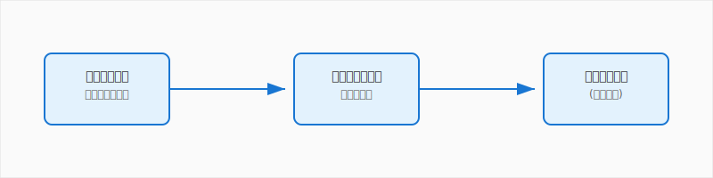
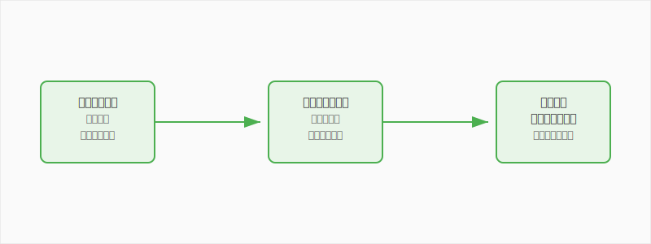

# 第1章　ゲームで学ぶ経営の基本

**学習目標**: 経営とは何か、なぜゲームが学習に有効かを理解する

---

## 1-1　経営って何だろう？

### スーパーマーケットの店長になったあなた

Supermarket Simulatorを初めて起動したとき、何を感じましたか？空っぽの店舗を前にして、「何から始めればいいんだろう」と思ったかもしれません。でも、まさにそれが**経営**の出発点なのです。

経営とは、簡単に言うと**「限られた資源を使って、お客様に価値を提供し、その対価として利益を得る活動」**のことです。

### 身近な経営の例を考えてみよう

経営は特別なことではありません。あなたの周りにも経営の例がたくさんあります。

**コンビニの場合**
- **資源**: 店舗、商品、スタッフ、お金
- **価値提供**: 24時間営業、便利な立地、必要な商品の提供
- **利益**: 商品の売上から仕入れ費用と人件費を引いた残り

**YouTuberの場合**
- **資源**: 時間、機材、アイデア、編集スキル
- **価値提供**: 楽しい動画、有益な情報
- **利益**: 広告収入、スーパーチャット、企業案件

**学園祭の模擬店の場合**
- **資源**: 予算、クラスメート、材料、時間
- **価値提供**: 美味しい食べ物、楽しい体験
- **利益**: 売上から材料費を引いた残り（多くの場合は利益追求が目的ではないですが）

### 経営者の仕事：意思決定の連続

経営者の仕事を一言で表すと、**「決めること」**です。Supermarket Simulatorをプレイしているとき、あなたは常に何かを決めています。

- どの商品を仕入れるか？
- 価格をいくらに設定するか？
- レジをいくつ設置するか？
- 店舗をどう拡張するか？

これらすべてが**経営判断**です。そして、その判断の結果が売上や利益として数字に現れます。

### 経営の3つの基本要素

経営には3つの基本要素があります：

#### 1. 効率性（Efficiency）
「限られた資源で最大の成果を出すこと」

ゲームでは：レジの待ち時間を減らす、商品の陳列を効率化する
現実では：無駄な作業を減らす、自動化を進める

#### 2. 有効性（Effectiveness）
「正しいことをすること」

ゲームでは：お客様が欲しがる商品を仕入れる、適切な価格設定をする
現実では：市場のニーズに合った商品・サービスを提供する

#### 3. 持続性（Sustainability）
「長期的に続けられること」

ゲームでは：借金を適切に管理する、安定した利益を確保する
現実では：環境や社会に配慮した経営を行う

---

## 1-2　なぜゲームで経営が学べるのか

### シミュレーションの力：安全に失敗できる環境

現実のビジネスで失敗すると、大きな損失が発生することがあります。でも、ゲームの中なら何度でも失敗できます。これが**シミュレーション学習**の最大のメリットです。

**例：価格設定の実験**
- 現実：商品の価格を間違えると、売れ残りや売上減少で実際の損失
- ゲーム：いろいろな価格を試して、売上への影響を安全に学習

### 即座のフィードバック：行動→結果のサイクル

ゲームの素晴らしい点は、行動の結果がすぐに分かることです。

現実のビジネスでは、施策の効果が分かるまで数ヶ月かかることもありますが、ゲームなら数分で結果が見えます。

### 複雑な現実をシンプルなモデルで理解

現実のスーパーマーケット経営は非常に複雑です：
- 数万種類の商品管理
- 複雑な法律や規制
- 天候や季節の影響
- 競合他社の動向
- スタッフの管理

ゲームはこれらを分かりやすく単純化しているので、経営の本質的な部分に集中して学習できます。

### ゲーム学習の3つの段階

**段階1：体験する**
まずはゲームを楽しみながらプレイし、経営の感覚を掴む

**段階2：分析する**
なぜうまくいったのか、失敗したのかを考える

**段階3：応用する**
学んだことを現実のビジネスや日常生活に活かす

---

## 1-3　Supermarket Simulatorの経営要素

### ゲーム内の主要な経営活動

Supermarket Simulatorには、現実のスーパーマーケット経営の要素が凝縮されています。

#### 1. 店舗設計・レイアウト
**ゲーム内**: 棚の配置、レジの位置、通路の幅を決める
**現実対応**: 店舗設計、顧客導線設計、作業効率の最適化
**学べること**: オペレーション設計、顧客体験設計

#### 2. 商品仕入れ・発注
**ゲーム内**: オンラインで商品を注文し、倉庫で管理する
**現実対応**: サプライチェーン管理、在庫管理
**学べること**: 需要予測、在庫最適化、キャッシュフロー管理

#### 3. 価格設定
**ゲーム内**: 市場価格を参考に、商品の売値を決める
**現実対応**: プライシング戦略、競合分析
**学べること**: 利益最大化、市場分析、顧客心理

#### 4. 接客・レジ対応
**ゲーム内**: お客様の会計処理、おつりの計算
**現実対応**: カスタマーサービス、オペレーション管理
**学べること**: 顧客満足度、サービス品質、効率化

#### 5. 店舗拡張・投資
**ゲーム内**: 利益で店舗を拡張し、設備を増強する
**現実対応**: 設備投資、事業拡大
**学べること**: 投資判断、成長戦略、リスク管理

#### 6. 財務管理
**ゲーム内**: 借入を行い、日々の収支を管理する
**現実対応**: 資金調達、財務計画
**学べること**: キャッシュフロー、借入返済、資金繰り

### 現実のスーパーマーケット経営との対応

| ゲーム要素 | 現実の対応 | 簡略化されている部分 |
|-----------|-----------|-------------------|
| 商品発注 | 仕入れ業務 | サプライヤーとの交渉、配送管理 |
| 価格設定 | プライシング | 法的規制、競合対応 |
| レジ対応 | 接客業務 | クレーム対応、複雑な決済 |
| 店舗拡張 | 設備投資 | 建築許可、工事管理 |
| 融資 | 資金調達 | 銀行審査、担保設定 |

### ゲームが教えてくれること、教えてくれないこと

**ゲームが教えてくれること**
- 経営の基本的な流れと関係性
- 数字（売上、利益、在庫）の重要性
- 意思決定の影響と結果
- 効率化の考え方

**ゲームでは学べないこと**
- 人材管理の複雑さ
- 法律や規制の制約
- 社会的責任
- 長期的な戦略立案

これを理解した上でゲームを活用することが大切です。

---

## 1-4　この本で学ぶこと

### 各章で扱う経営概念の概要

この本は、あなたのゲーム体験を出発点として、経営学の基本を体系的に学べる構成になっています。

**第2章：店舗設計と顧客導線**
ゲームでのレイアウト設計から、現実のオペレーション設計を学びます。効率性と顧客満足度を両立させる考え方を身につけます。

**第3章：仕入れと在庫の科学**
商品発注の体験から、需要予測と在庫管理の重要性を理解します。データ分析の基本も学習します。

**第4章：価格戦略の考え方**
価格設定の体験から、プライシング戦略と競合分析の方法を習得します。利益を最大化する思考法を学びます。

**第5章：顧客満足度の管理**
レジ対応の体験から、カスタマーサービスとサービス品質管理を理解します。

**第6章：成長戦略と投資判断**
店舗拡張の体験から、投資判断と成長戦略の立案方法を学習します。

**第7章：お金の流れを理解する**
ゲーム内の収支管理から、財務管理とキャッシュフローの基本を習得します。

**第8章：データで経営を改善する**
売上分析の体験から、データドリブン経営の考え方を身につけます。

**第9章：現実世界のビジネスへ**
学習内容を実社会に応用する方法と、将来のキャリアについて考えます。

### 学習の進め方とポイント

#### 1. ゲーム体験を振り返る
各章の始めに、該当するゲーム体験を思い出しましょう。「あのとき、なぜそう判断したのか」を考えることが重要です。

#### 2. 概念を理解する
ゲーム体験を経営学の概念に置き換えて理解します。抽象的な話も、具体的な体験があれば理解しやすくなります。

#### 3. 現実の事例で確認する
身近な企業の事例を通じて、学んだ概念が現実でどう使われているかを確認します。

#### 4. 演習で定着させる
各章末の演習問題で、理解度を確認し、知識を定着させます。

#### 5. 日常生活で応用する
学んだ思考法を、学校生活や日常の判断に活かしてみましょう。

### 実社会への応用可能性

この本で学ぶスキルは、将来様々な場面で役立ちます：

**学校生活で**
- 学園祭の企画運営
- 部活動の効率化
- 勉強計画の立案

**将来の進路で**
- 大学でのビジネス系学部での学習
- 就職活動での企業研究
- 起業や経営への挑戦

**日常生活で**
- 家計管理
- 時間管理
- 問題解決スキル

---

## 章末演習：ゲーム体験の振り返りシート

以下のシートを使って、これまでのSupermarket Simulatorでの体験を振り返ってみましょう。

### 振り返りシート

**1. 最初にプレイしたときの印象**
- 最初に困ったことは何でしたか？
- どの作業が一番難しかったですか？
- どの作業が一番楽しかったですか？

**2. 成功体験**
- 売上が大きく伸びたときのことを思い出してください
- そのとき、何をしましたか？
- なぜうまくいったと思いますか？

**3. 失敗体験**
- 売上が下がったり、困ったりしたことはありましたか？
- 何が原因だったと思いますか？
- その後、どう改善しましたか？

**4. 意思決定の場面**
- 価格設定で迷ったことはありますか？どう決めましたか？
- 店舗拡張のタイミングはどう判断しましたか？
- 借入をするかどうか、どう決めましたか？

**5. 学んだこと**
- ゲームを通じて学んだことを3つ書いてください
- 現実のお店で同じことが起きていると思いますか？

**6. 疑問・関心**
- もっと詳しく知りたいことはありますか？
- 現実のスーパーマーケットはどうなっているか気になりますか？

### 振り返りのポイント

この振り返りに正解はありません。大切なのは、自分の体験を言葉にして、なぜそう感じたのかを考えることです。

この振り返りシートは、本書を読み進める上での「学習の出発点」になります。各章で新しい概念を学ぶとき、この振り返りを参考にすると、理解が深まるでしょう。

---

**第1章のまとめ**

- 経営とは「限られた資源で価値を創造し、利益を得る活動」
- ゲーム学習は安全に失敗でき、即座にフィードバックを得られる
- Supermarket Simulatorには現実の経営要素が凝縮されている
- 体験を概念化し、現実に応用することで学習効果が高まる

次の第2章では、店舗設計と顧客導線について、より詳しく学んでいきます。

