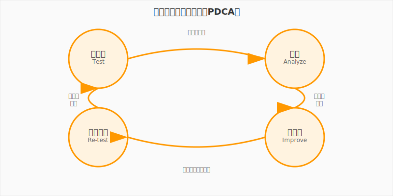

# 第2章　店舗設計と顧客導線

**学習目標**: 効率的なオペレーション設計と顧客体験の重要性を理解する

---

## 2-1　レイアウトが売上を決める

### あなたの店舗設計を思い出してみよう

Supermarket Simulatorで初めて店舗をデザインしたとき、どんなことを考えましたか？

「レジはどこに置こう？」
「冷凍食品の棚はどこがいいかな？」
「お客様が買い物しやすいように通路を広くしよう」

これらの判断すべてが**店舗設計**であり、**オペレーション設計**の基本なのです。そして、この設計の良し悪しが、直接売上に影響します。

### ゲーム内レイアウト設計の体験を分析してみよう

ゲームをプレイしていて、こんな経験はありませんでしたか？

**うまくいったとき**
- お客様がスムーズに買い物をして、レジ待ちも少ない
- 自分も効率よく商品補充ができる
- 売上が安定して伸びる

**うまくいかなかったとき**
- レジに長い行列ができて、お客様が帰ってしまう
- 商品補充のために何度も往復する必要がある
- 売上が伸び悩む

この違いは何でしょうか？答えは**「導線設計」**にあります。

### 「導線」という考え方

**導線（どうせん）**とは、人が移動する経路のことです。店舗設計では、以下の2つの導線を考える必要があります：

#### 1. 顧客導線
お客様が店内を移動する経路
- 入口から商品棚へ
- 商品棚からレジへ
- レジから出口へ

#### 2. 作業導線
スタッフが作業をするための移動経路
- 倉庫から商品棚への補充ルート
- レジ間の移動
- 清掃作業の効率的なルート

### レイアウト設計の基本原則

効果的な店舗レイアウトには、いくつかの基本原則があります：

#### 原則1: シンプルで分かりやすい
**ゲームでの体験**: 商品カテゴリごとに棚をまとめて配置
**現実での応用**: 
- 食品、日用品、雑貨などのエリア分け
- 明確なサイン表示
- 直感的に分かる商品配置

#### 原則2: 自然な流れを作る
**ゲームでの体験**: 入口から奥へ、そしてレジへの自然な流れ
**現実での応用**:
- 右回り（時計回り）の導線（日本では右利きが多いため）
- 必需品は奥に、嗜好品は手前に配置
- 衝動買いを誘う商品配置

#### 原則3: ボトルネックを避ける
**ゲームでの体験**: レジ前の混雑、狭い通路での立ち往生
**現実での応用**:
- 十分な通路幅の確保
- 複数のレジ設置
- ピーク時間の分散対策

#### 原則4: 効率的な作業動線
**ゲームでの体験**: 倉庫から各棚への最短ルート
**現実での応用**:
- バックヤードと売場の近接配置
- 頻繁に補充する商品は作業しやすい場所に
- 重い商品は低い棚に配置

### 効率性と利便性のトレードオフ

店舗設計では、しばしば**効率性**と**利便性**の間でバランスを取る必要があります。

**効率性重視の例**
- 棚を高くして商品陳列量を最大化
- 通路を狭くして売場面積を拡大
- レジを最小限に抑えて人件費削減

**利便性重視の例**
- 低い棚でお客様が商品を取りやすく
- 広い通路でゆったりとした買い物環境
- 多数のレジで待ち時間を短縮

**最適解を見つける方法**
1. **目標の明確化**: 何を最優先するのか？（売上？利益？顧客満足度？）
2. **データの活用**: お客様の行動データ、売上データの分析
3. **継続的改善**: 小さな変更を試して効果を測定
4. **顧客の声**: アンケートや観察による顧客ニーズの把握

---

## 2-2　顧客の行動を予測する

### お客様はどう動くのか

効果的な店舗設計のためには、お客様の行動パターンを理解することが重要です。

#### ゲーム内での観察
Supermarket Simulatorをプレイしているとき、お客様の行動をよく観察してみてください：

- どの商品から取り始めるか？
- どんな順番で店内を回るか？
- レジでどのくらい待つか？
- どんなときに途中で帰ってしまうか？

#### 現実の顧客行動パターン

**入店直後の行動**
- まず店内全体を見渡す（約3秒）
- 目的の商品がある方向を確認
- 買い物カゴやカートを取る

**買い物中の行動**
- 必需品を最初に取る傾向
- 棚の目線の高さ（ゴールデンゾーン）を最初に見る
- 右手で取りやすい位置を好む（右利きの場合）
- 試食やサンプルがあると立ち止まる

**レジでの行動**
- 待ち時間が2分を超えると不満を感じ始める
- 待っている間に雑誌やお菓子を手に取る
- 現金よりカード決済を好む人が増加

### ボトルネック（混雑ポイント）の発見

**ボトルネック**とは、流れが詰まりやすい場所のことです。店舗でよくあるボトルネックは：

#### 1. レジ前
**問題**: 
- ピーク時間（夕方、土日）の大行列
- レジ操作の遅れ
- 支払い方法の多様化による時間増加

**解決策**:
- セルフレジの導入
- ピーク時間の人員増加
- 事前会計システム（スマホ決済など）

#### 2. 入口・出口付近
**問題**:
- 雨の日の傘立て周辺の混雑
- カート置き場での渋滞
- 特売商品コーナーでの人だかり

**解決策**:
- 入口と出口の分離
- 十分なスペースの確保
- 特売商品の分散配置

#### 3. 狭い通路
**問題**:
- カート同士のすれ違いができない
- 商品を選んでいる人の後ろで待ち
- 大型商品の運搬困難

**解決策**:
- 通路幅の標準化（最低1.2m）
- 一方通行の導入
- 待避スペースの設置

### 待ち時間と顧客満足度の関係

心理学の研究によると、待ち時間に対する人の感じ方には特徴があります：

#### 体感時間と実際時間の違い

| 実際の待ち時間 | 体感時間 | 顧客の心理状態 |
|--------------|---------|--------------|
| 30秒以下 | ほぼ同じ | 気にならない |
| 1分 | 1.5分程度 | やや気になる |
| 2分 | 3分程度 | イライラし始める |
| 3分以上 | 5分以上 | 強い不満 |

#### 待ち時間を短く感じさせる工夫

**1. 情報提供**
- 「あと○分でご案内できます」
- 混雑状況の表示
- レジの空き状況の案内

**2. 気分転換**
- 雑誌やお菓子の配置
- 音楽やデジタルサイネージ
- 子供向けの遊び場

**3. 有効活用感**
- スマホアプリでのポイント確認
- 次回使えるクーポンの配布
- 商品情報の提供

### 顧客行動分析の方法

#### 1. 直接観察
**方法**: 店舗内での顧客行動の観察
**メリット**: リアルな行動が分かる
**デメリット**: 時間がかかる、主観的

#### 2. データ分析
**方法**: POSデータ、防犯カメラの映像分析
**メリット**: 客観的、大量データの処理可能
**デメリット**: 設備投資が必要、行動の理由が分からない

#### 3. アンケート調査
**方法**: 顧客への直接質問
**メリット**: 理由や感情が分かる
**デメリット**: 回答率が低い、実際の行動と違う場合がある

#### 4. ヒートマップ分析
**方法**: 店内での顧客の滞在時間や移動経路を可視化
**メリット**: 視覚的に分かりやすい、パターンが見えやすい
**デメリット**: 専用システムが必要

---

## 2-3　現実の店舗設計事例

実際の企業がどのような店舗設計を行っているか、具体的な事例を見てみましょう。

### 事例1: コンビニの科学的レイアウト

コンビニエンスストアは、限られた空間で最大の売上を上げるため、非常に計算された店舗設計を行っています。

#### セブン-イレブンの基本レイアウト

**入口付近（ホットスポット）**
- 新商品、季節商品
- 雑誌、新聞
- ATM

**理由**: 入店したお客様が必ず通る場所なので、注目度が高い

**奥のエリア**
- 飲料（冷蔵庫）
- 冷凍食品
- 米、調味料

**理由**: 必需品を奥に置くことで、お客様に店内を歩いてもらい、他の商品も見てもらう

**レジ前**
- お菓子、ガム
- 小物、充電器
- ホットフード

**理由**: 待ち時間を利用した衝動買いを誘う

#### コンビニの導線設計の工夫

**右回りの導線**
- 日本人の多くは右利きなので、右手で商品を取りやすい
- 時計回りの動きは心理的に自然

**ゴールデンゾーン**
- 棚の高さ60cm〜180cm（目線から手が届く範囲）
- 最も売れる商品をこの高さに配置

**クロスマーチャンダイジング**
- 関連商品を近くに配置
- 例：カップ麺の近くに卵、パンの近くにバター

### 事例2: IKEAの一方通行動線戦略

IKEA（イケア）は、独特な店舗設計で有名です。

#### 一方通行システム

**特徴**:
- 店内は基本的に一方通行
- すべての売場を通らないと出口に到達できない
- 途中で引き返すのが困難

**狙い**:
- 商品接触機会の最大化
- 計画していなかった商品の購入促進
- ブランド世界観の体験

#### ショールーム形式

**特徴**:
- 実際の部屋のように商品をディスプレイ
- 商品の使用シーンを具体的にイメージできる
- 写真撮影スポットとしても機能

**効果**:
- 商品の魅力が伝わりやすい
- セット購入の促進
- SNSでの拡散効果

#### 子供向け設備

**キッズエリア「スモーランド」**
- 子供を預けて、大人がゆっくり買い物
- 子供連れ家族の滞在時間延長
- ファミリー向けブランドイメージの確立

### 事例3: スーパーマーケットの売場配置の法則

一般的なスーパーマーケットには、長年の経験から生まれた配置の法則があります。

#### 入口付近の戦略

**青果売場を最初に配置**
**理由**:
- 新鮮さをアピール
- 色鮮やかで店の印象が良くなる
- 健康的なイメージを与える

**特売商品のワゴン**
**理由**:
- 入店直後にお得感を演出
- 客足を止めて店内に誘導
- 話題性のある商品で関心を引く

#### 必需品の奥配置

**米、調味料、冷凍食品を奥に**
**理由**:
- 必ず購入する商品で店内回遊を促進
- 途中で他の商品も見てもらう
- 冷凍品は最後に取ってもらい鮮度保持

#### エンドキャップ活用

**エンドキャップ**: 棚の端（通路に面した部分）

**活用方法**:
- 季節商品の訴求
- 新商品の紹介
- 関連商品のクロス販売

**効果**:
- 通常の棚より3〜5倍の注目度
- 売上向上効果が高い

#### カテゴリー配置の論理

| 売場 | 配置場所 | 理由 |
|------|---------|------|
| 青果 | 入口付近 | 新鮮さアピール、色彩効果 |
| 精肉・鮮魚 | 中央〜奥 | 冷蔵設備の効率化 |
| 惣菜 | 出口近く | 最後に購入で鮮度保持 |
| パン | 香りが広がる場所 | 食欲を刺激する効果 |
| 日用品 | 食品と分離 | 購買パターンの違い |

---

## 2-4　設計思考を身につけよう

### 設計思考とは何か

**設計思考（Design Thinking）**とは、ユーザーの立場に立って問題を発見し、創造的に解決する方法論です。

#### 設計思考の5つのステップ

**1. 共感（Empathize）**
ユーザーの立場に立って、ニーズや課題を理解する

**2. 問題定義（Define）**
観察したことから、本当の問題を明確にする

**3. アイデア創出（Ideate）**
解決策のアイデアを数多く出す

**4. プロトタイプ（Prototype）**
アイデアを形にして試せるようにする

**5. テスト（Test）**
実際に試して、フィードバックを得る

### 店舗設計への設計思考の応用

#### ステップ1: 共感 - お客様の立場で考える

**方法**:
- 実際に自分が客として店を利用してみる
- 家族や友人に買い物体験を聞く
- 店内でお客様の行動を観察する

**質問例**:
- どんなときに不便を感じるか？
- どんな商品を探すのに時間がかかるか？
- どんなサービスがあったら嬉しいか？

#### ステップ2: 問題定義 - 本当の課題を見つける

**表面的な問題**: 「レジが混んでいる」
**本当の問題**: 
- ピーク時の人員不足？
- レジ作業の非効率？
- 支払い方法の多様化への対応不足？

**問題の深掘り方法**:
- 「なぜ？」を5回繰り返す
- データで問題の規模を把握する
- 複数の関係者の視点を聞く

#### ステップ3: アイデア創出 - 解決策を考える

**ブレインストーミングのルール**:
- 批判しない
- 自由奔放にアイデアを出す
- 量を重視する
- 他人のアイデアに便乗する

**アイデア例（レジ混雑解決）**:
- セルフレジの導入
- 事前会計システム
- ピーク時間の分散（割引タイム）
- 待ち時間の有効活用（クーポン配布）
- 移動レジの導入

#### ステップ4: プロトタイプ - 小さく試す

**店舗設計のプロトタイプ方法**:
- 紙や段ボールで模型を作る
- コンピューターシミュレーション
- 一部エリアでの試験実施
- 他店舗での成功事例の参考

**プロトタイプの原則**:
- 完璧を求めない
- 短期間で作る
- 重要な部分に焦点を当てる
- フィードバックを得やすくする

#### ステップ5: テスト - 検証して改善する

**テスト方法**:
- A/Bテスト（2つのパターンを比較）
- ユーザーテスト（実際に使ってもらう）
- データ分析（売上、滞在時間など）
- アンケート調査

**改善のサイクル**:

### A/Bテストの考え方

**A/Bテスト**とは、2つの異なるパターンを同時に試して、どちらが良い結果を出すかを比較する方法です。

#### 店舗設計でのA/Bテスト例

**テスト内容**: 特売商品の配置場所
- **パターンA**: 入口付近に配置
- **パターンB**: 店内奥に配置

**測定指標**:
- 特売商品の売上
- 店内滞在時間
- 全体売上への影響

**テスト期間**: 2週間（同じ曜日で比較）

**結果分析**:
- 数値データの比較
- お客様の行動観察
- スタッフの作業効率

### データに基づく意思決定

感覚や経験だけでなく、データを活用することで、より良い意思決定ができます。

#### 収集すべきデータ

**売上データ**
- 時間帯別売上
- 商品カテゴリ別売上
- 客単価の変化

**顧客行動データ**
- 滞在時間
- 移動経路
- 商品接触回数

**運営データ**
- スタッフの作業効率
- 在庫回転率
- クレーム件数

#### データ分析の基本

**1. 比較する**
- 過去との比較
- 他店舗との比較
- 業界平均との比較

**2. 傾向を見る**
- 時系列の変化
- 季節性の確認
- 成長率の計算

**3. 関係性を調べる**
- 要因と結果の関係
- 相関関係の分析
- 因果関係の推定

---

## 章末演習

### 演習1: 理想的な店舗レイアウト設計

以下の条件で、理想的なスーパーマーケットのレイアウトを設計してください。

**条件**:
- 店舗面積: 200㎡（約60坪）
- 想定客数: 1日300人
- 主要顧客: ファミリー層
- 取扱商品: 食品、日用品、雑貨

**設計要素**:
1. 売場配置（青果、精肉、日用品など）
2. レジの位置と数
3. 顧客導線
4. バックヤードとの関係

**提出物**:
- レイアウト図（手描きでOK）
- 設計理由の説明（各エリアの配置理由）
- 期待される効果

### 演習2: 混雑解消プラン作成

あなたがSupermarket Simulatorでプレイしているときに、レジに長い行列ができてお客様が帰ってしまう問題が発生しました。

**現状分析**:
- ピーク時間: 夕方5時〜7時
- レジ数: 2台
- 平均会計時間: 2分/人
- ピーク時来客数: 30人/時間

**課題**:
この問題を解決するプランを作成してください。

**検討項目**:
1. 問題の根本原因分析
2. 解決策のアイデア（最低5つ）
3. 最も効果的と思われる解決策の選択理由
4. 実施計画（優先順位、実施時期）
5. 効果測定方法

### 演習3: 顧客行動観察レポート

実際のお店（コンビニ、スーパー、書店など）で顧客行動を観察し、レポートを作成してください。

**観察項目**:
1. 入店から退店までの一般的な行動パターン
2. よく立ち止まる場所とその理由
3. 混雑が発生しやすい場所と時間
4. 店舗の工夫点（良い点）
5. 改善できそうな点

**レポート構成**:
- 観察店舗の概要
- 観察結果（項目別）
- 分析と考察
- 改善提案

**注意事項**:
- 店舗に迷惑をかけないよう配慮する
- 写真撮影は控える
- プライバシーに配慮する

### 演習4: 設計思考実践

身近な場所（教室、図書館、食堂など）の使いやすさを設計思考で改善してみましょう。

**ステップ1: 共感**
- 利用者の立場で不便な点を観察
- 複数の利用者に話を聞く

**ステップ2: 問題定義**
- 最も重要な問題を1つ選択
- 問題の背景と影響を分析

**ステップ3: アイデア創出**
- 解決策を最低10個考える
- 実現可能性は考えず自由に発想

**ステップ4: プロトタイプ**
- 最も有望なアイデアを具体化
- 簡単な模型や図で表現

**ステップ5: テスト**
- どのように効果を確認するか計画
- 想定される課題と対策

**提出物**:
- 各ステップの作業内容
- 最終的な改善提案
- 実現のための具体的なステップ

---

**第2章のまとめ**

- 店舗レイアウトは売上に直結する重要な要素
- 顧客導線と作業導線の両方を考慮した設計が必要
- 効率性と利便性のバランスが重要
- 設計思考により体系的に問題解決ができる
- データに基づく継続的改善が成功の鍵

次の第3章では、仕入れと在庫管理について、より詳しく学んでいきます。商品をいつ、どれだけ発注するかという判断は、キャッシュフローと直結する重要な経営スキルです。

