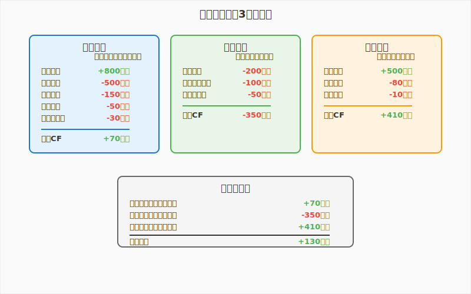

# 第7章　お金の流れを理解する


**学習目標**: 財務管理とキャッシュフローの基本を理解する

---

## 7-1　会社のお金の流れ

### ゲーム内収支管理の体験を振り返ろう

Supermarket Simulatorで一日の営業を終えて収支を確認するとき、どんなことを感じましたか？

「今日は売上が良かったけど、商品の仕入れにお金を使いすぎた」
「利益は出ているのに、手元にあまり現金がない」
「借入金の返済があるから、来月の資金繰りが心配」

これらの体験は、実際のビジネスでも経営者が毎日直面している**財務管理**の基本的な課題なのです。

### お金の3つの流れ

会社のお金には3つの異なる流れがあります。これを理解することが財務管理の出発点です。



### 売上、費用、利益の関係

ビジネスの基本的なお金の計算を理解しましょう。

#### 基本的な計算式

**売上 - 費用 = 利益**

```
例：1日の営業結果
売上：30万円
仕入原価：18万円（売上の60%）
人件費：5万円
家賃：2万円
光熱費：1万円
その他：1万円

利益 = 30万円 - (18万円 + 5万円 + 2万円 + 1万円 + 1万円)
     = 30万円 - 27万円 = 3万円
```

#### 費用の分類

**変動費**
売上に比例して変化する費用

```
例：
仕入原価：売上が増えると比例して増加
包装材費：販売数量に比例
配送費：販売量に比例
```

**固定費**
売上に関係なく発生する費用

```
例：
家賃：売上に関係なく毎月一定
人件費（基本給）：販売量に関係なく一定
保険料：売上に関係なく年間一定
```

**損益分岐点の再確認**
```
損益分岐点売上 = 固定費 ÷ (1 - 変動費率)

例：
固定費：月20万円
変動費率：60%（売上に対する仕入原価の割合）

損益分岐点 = 20万円 ÷ (1 - 0.6) = 20万円 ÷ 0.4 = 50万円

→ 月間売上50万円で損益がゼロ
→ 50万円を超えた分が利益
```

### キャッシュフローの重要性

**利益が出ているのに倒産する**という現象が実際に起こります。これを理解するために、利益と現金の違いを学びましょう。

#### 利益と現金の違い

**利益（会計上の計算）**
```
売上：商品を販売した時点で計上
費用：商品を仕入れた時点で計上

例：掛け売りの場合
4月に100万円の売上（入金は6月）
4月に60万円の仕入（支払いは5月）
4月の利益：40万円

→ 利益は出ているが、現金は動いていない
```

**現金（実際のお金の動き）**
```
現金収入：実際にお金が入ってきた時
現金支出：実際にお金が出て行った時

上記例の現金の動き：
4月：現金の動きなし
5月：60万円の支出
6月：100万円の収入

→ 5月は40万円の現金不足が発生
```

#### 黒字倒産の仕組み

```
状況例：急成長している会社
売上：毎月20%成長
仕入：売上の60%
支払サイト：売上入金は2ヶ月後、仕入支払は1ヶ月後

月次推移：
1月：売上100万円（3月入金）、仕入60万円（2月支払）
2月：売上120万円（4月入金）、仕入72万円（3月支払）
3月：売上144万円（5月入金）、仕入86万円（4月支払）

現金の動き：
1月：支出なし
2月：60万円支出
3月：100万円収入、72万円支出 → 28万円収入
4月：120万円収入、86万円支出 → 34万円収入

問題：売上成長に伴い運転資金が増加
→ 利益は出ているが現金不足で倒産リスク
```

### 運転資金の概念

**運転資金**とは、日常の営業活動に必要な資金のことです。

#### 運転資金の計算

```
運転資金 = 売掛金 + 在庫 - 買掛金

売掛金：お客様に売ったがまだ回収していないお金
在庫：仕入れたがまだ売っていない商品
買掛金：仕入れたがまだ支払っていないお金
```

**具体例**
```
売掛金：200万円（2ヶ月分の売上）
在庫：150万円（1ヶ月分の仕入）
買掛金：100万円（1ヶ月分の仕入）

運転資金 = 200万円 + 150万円 - 100万円 = 250万円

→ 営業するために250万円の現金が必要
```

#### 運転資金の改善方法

**回収期間の短縮**
```
現状：売上から入金まで60日
改善：売上から入金まで30日

効果：売掛金が半分になり、運転資金が改善
```

**在庫期間の短縮**
```
現状：在庫回転期間30日
改善：在庫回転期間20日

効果：在庫が1/3減り、運転資金が改善
```

**支払期間の延長**
```
現状：仕入から支払まで30日
改善：仕入から支払まで45日

効果：買掛金が1.5倍になり、運転資金が改善
```

---

## 7-2　財務三表の基本

会社の財務状況を把握するために、3つの重要な表があります。これを**財務三表**と呼びます。

### 損益計算書（P/L）：儲けを表す

**損益計算書（Profit & Loss Statement）**は、一定期間の会社の儲けを表す表です。

#### 損益計算書の構造

```
売上高　　　　　　　　　　1,000万円
　売上原価　　　　　　　　　600万円
売上総利益（粗利）　　　　　400万円
　販売管理費　　　　　　　　300万円
営業利益　　　　　　　　　　100万円
　営業外費用（利息等）　　　 20万円
経常利益　　　　　　　　　　 80万円
　特別損失　　　　　　　　　 10万円
税引前当期純利益　　　　　　 70万円
　法人税等　　　　　　　　　 20万円
当期純利益　　　　　　　　　 50万円
```

#### ゲーム体験との対応

```
Supermarket Simulatorの1日の結果：

売上：30万円
　仕入原価：18万円
粗利：12万円
　人件費：5万円
　家賃：2万円
　光熱費：1万円
営業利益：4万円

→ これが簡易版の損益計算書
```

#### 損益計算書から分かること

**収益性の分析**
```
売上総利益率 = 売上総利益 ÷ 売上 × 100
= 400万円 ÷ 1,000万円 × 100 = 40%

営業利益率 = 営業利益 ÷ 売上 × 100
= 100万円 ÷ 1,000万円 × 100 = 10%

当期純利益率 = 当期純利益 ÷ 売上 × 100
= 50万円 ÷ 1,000万円 × 100 = 5%
```

### 貸借対照表（B/S）：資産と負債を表す

**貸借対照表（Balance Sheet）**は、ある時点での会社の財産と借金を表す表です。

#### 貸借対照表の構造

```
【資産の部】
流動資産：
　現金・預金　　　　　200万円
　売掛金　　　　　　　150万円
　在庫　　　　　　　　100万円
　　小計　　　　　　　450万円

固定資産：
　建物　　　　　　　　300万円
　機械装置　　　　　　200万円
　　小計　　　　　　　500万円

資産合計　　　　　　　950万円

【負債・純資産の部】
流動負債：
　買掛金　　　　　　　80万円
　短期借入金　　　　　120万円
　　小計　　　　　　　200万円

固定負債：
　長期借入金　　　　　250万円

負債合計　　　　　　　450万円

純資産：
　資本金　　　　　　　300万円
　利益剰余金　　　　　200万円
　　小計　　　　　　　500万円

負債・純資産合計　　　950万円
```

#### 貸借対照表の基本ルール

**資産 = 負債 + 純資産**

```
資産（950万円）= 負債（450万円）+ 純資産（500万円）

意味：
資産：会社が持っている財産
負債：他人からの借金
純資産：自分のお金（資本金+これまでの利益）
```

#### ゲーム体験との対応

```
ゲーム開始時の状況：
現金：100万円（初期資金）
商品在庫：50万円
店舗設備：200万円
借入金：150万円
自己資金：200万円

→ 資産350万円 = 負債150万円 + 純資産200万円
```

### キャッシュフロー計算書：現金の動きを表す

**キャッシュフロー計算書**は、現金の動きを3つの活動に分けて表示する表です。

#### キャッシュフロー計算書の構造

```
【営業活動によるキャッシュフロー】
　当期純利益　　　　　　　　50万円
　減価償却費　　　　　　　　30万円
　売掛金の増加　　　　　　△20万円
　在庫の増加　　　　　　　△10万円
　買掛金の増加　　　　　　　15万円
　営業CF　　　　　　　　　 65万円

【投資活動によるキャッシュフロー】
　設備投資　　　　　　　　△100万円
　投資CF　　　　　　　　　△100万円

【財務活動によるキャッシュフロー】
　借入による収入　　　　　　80万円
　借入金の返済　　　　　　△30万円
　財務CF　　　　　　　　　 50万円

現金の増加　　　　　　　　　15万円
期首現金残高　　　　　　　　200万円
期末現金残高　　　　　　　　215万円
```

#### 3つのキャッシュフローの意味

**営業キャッシュフロー**
```
プラス：本業でお金を稼いでいる
マイナス：本業でお金を失っている

健全な企業：営業CFは継続してプラス
```

**投資キャッシュフロー**
```
マイナス：将来のために投資している
プラス：資産を売却している

成長企業：通常は投資CFがマイナス
```

**財務キャッシュフロー**
```
プラス：借入や増資で資金調達
マイナス：借入返済や配当支払

成長期：通常は財務CFがプラス
成熟期：借入返済で財務CFがマイナス
```

### 財務三表の関係

3つの表は密接に関連しています。

#### 関係性の理解

```
損益計算書の当期純利益
　↓
貸借対照表の利益剰余金に蓄積
　↓
キャッシュフロー計算書の営業CFの起点

例：
当期純利益50万円
→ 利益剰余金が50万円増加
→ 営業CFの計算が当期純利益50万円から開始
```

#### 簡易財務三表の作成例

**ゲーム1日分のデータから作成**

```
【損益計算書（1日分）】
売上　　　　　30万円
仕入原価　　　18万円
粗利　　　　　12万円
人件費　　　　 5万円
家賃　　　　　 2万円
その他　　　　 2万円
利益　　　　　 3万円

【貸借対照表（期末）】
現金　　　　　53万円（前日50万円+利益3万円）
在庫　　　　　30万円
設備　　　　　100万円
資産計　　　　183万円

借入金　　　　80万円
純資産　　　　103万円（前日100万円+利益3万円）
負債・純資産計　183万円

【キャッシュフロー（1日分）】
営業CF　　　　 3万円（利益と同額：現金商売のため）
投資CF　　　　 0万円
財務CF　　　　 0万円
現金増加　　　 3万円
```

---

## 7-3　借入と返済の管理

### ゲーム内融資システムの分析

Supermarket Simulatorでは、事業拡大のために銀行から融資を受けることができます。この体験を通じて、現実の借入管理を学びましょう。

#### 借入の目的と種類

**ゲーム内での借入理由**
```
設備投資：
- 店舗拡張
- レジ増設
- 冷蔵設備導入

運転資金：
- 商品仕入の増加
- 季節商品の大量仕入
- 売上入金までのつなぎ資金
```

**現実での借入目的**
```
設備資金：
- 店舗建設・改装
- 機械設備購入
- システム導入

運転資金：
- 商品仕入代金
- 人件費・家賃の支払
- 季節変動への対応
```

### 借入の種類と特徴

#### 短期借入（1年以内）

**運転資金借入**
```
目的：日常の資金繰り
期間：3ヶ月～1年
金利：比較的低い（年1-3%）
担保：不要な場合が多い

例：
借入額：300万円
期間：6ヶ月
金利：年2%
月々の利息：300万円 × 2% ÷ 12 = 0.5万円
```

**当座貸越**
```
仕組み：限度額内で自由に借入・返済
利用例：一時的な資金不足の解消
メリット：必要な時だけ利息負担
注意点：金利が比較的高い
```

#### 長期借入（1年超）

**設備資金借入**
```
目的：設備投資
期間：3年～20年
金利：短期より高め（年2-5%）
担保：設備や不動産

例：
借入額：1,000万円
期間：5年
金利：年3%
月々返済額：約18万円
```

**元利均等返済 vs 元金均等返済**

```
元利均等返済：
毎月の返済額が一定
初期は利息が多く、後期は元金が多い

元金均等返済：
毎月の元金返済額が一定
初期の返済額が多く、後期は少なくなる

1,000万円・5年・3%の場合：
元利均等：毎月約18万円
元金均等：初月20.8万円→最終月16.7万円
```

### 返済計画とリスク管理

#### 返済計画の立て方

**返済原資の確保**
```
必要な条件：
月間キャッシュフロー > 月間返済額

例：
月間返済額：20万円
必要な月間営業CF：25万円以上（余裕を持って）

月間売上：200万円
月間粗利：80万円（粗利率40%）
月間固定費：50万円
月間営業CF：30万円

→ 返済可能と判断
```

**債務償還年数**
```
債務償還年数 = 有利子負債 ÷ 年間営業CF

例：
有利子負債：1,500万円
年間営業CF：300万円
債務償還年数：5年

判断基準：
10年以内：良好
10-15年：注意
15年超：危険
```

#### 借入リスクの管理

**金利変動リスク**
```
変動金利の場合：
基準金利の上昇で返済額増加

対策：
- 固定金利の選択
- 金利上昇時の影響試算
- 早期返済の検討
```

**流動性リスク**
```
売上減少時の返済困難

対策：
- 保守的な借入計画
- 複数の金融機関との取引
- 緊急時資金の確保
```

**担保リスク**
```
担保価値の下落
事業悪化時の担保処分

対策：
- 無担保借入の活用
- 担保余力の確保
- 保証制度の利用
```

### 資金調達の選択肢

#### 銀行借入以外の調達方法

**親族・知人からの借入**
```
メリット：
- 金利が低い（無利息も可能）
- 審査が簡単
- 返済条件の柔軟性

デメリット：
- 金額の限界
- 人間関係のリスク
- 税務上の注意点
```

**公的融資制度**
```
日本政策金融公庫：
- 創業融資
- 設備資金
- 運転資金

地方自治体の制度融資：
- 利子補給制度
- 保証料の軽減
- 地域企業向け優遇
```

**リースの活用**
```
設備投資の代替手段：
初期費用の軽減
メンテナンス込み
税務上の優遇

例：レジシステム
購入：200万円（一括支払）
リース：月額4万円×5年（総額240万円）

選択基準：
- 初期投資の軽減効果
- 総コストの比較
- 技術更新のペース
```

---

## 7-4　現実の財務管理事例

### 事例1: 中小企業の資金繰り管理

中小企業のリアルな資金繰り管理の実例を見てみましょう。

#### A商店（小売業）の資金繰り

**基本情報**
```
従業員：10名
月間売上：2,000万円
月間粗利：600万円（粗利率30%）
月間固定費：500万円
月間営業利益：100万円
```

**資金繰りの課題**
```
問題：
年末商戦での大量仕入により一時的な資金不足

状況：
11月仕入：1,200万円（通常800万円）
12月売上：3,000万円（通常2,000万円）
支払サイト：仕入の翌月払い
入金サイト：売上の当月末入金

11月末資金残高：200万円
12月支払予定：1,200万円（11月仕入分）
→ 1,000万円の資金不足
```

**解決策の検討**
```
選択肢1：銀行借入
短期借入：1,000万円
金利：年2%
期間：2ヶ月
利息負担：約3.3万円

選択肢2：支払条件の交渉
仕入先への支払延期要請
1ヶ月延期で資金繰り改善

選択肢3：売上債権の早期回収
得意先への入金前倒し依頼
手数料負担で早期回収

実際の対応：
銀行借入500万円 + 支払延期500万円
→ リスク分散と関係維持
```

#### 資金繰り表の作成

**3ヶ月先までの資金繰り予測**
```
　　　　　　11月　　12月　　1月
前月繰越　　200　　　50　　850
売上入金　2,000　3,000　2,000
その他収入　500　　　0　　　0（借入）
収入計　　2,700　3,050　2,850

仕入支払　　800　1,200　1,000
人件費　　　200　　200　　200
家賃等　　　150　　150　　150
借入返済　　　0　　　0　　500
その他支出　500　　650　　500
支出計　　1,650　2,200　2,350

次月繰越　1,050　　850　　500

分析：
12月は大幅な資金不足
1月は売上正常化で資金回復
2月以降は借入返済で資金減少
```

### 事例2: 上場企業の財務戦略

大手企業の財務戦略の特徴を理解しましょう。

#### トヨタ自動車の財務戦略

**財務の特徴**
```
現金・預金：約4兆円（2023年3月末）
有利子負債：約17兆円
自己資本比率：約40%

特徴：
- 豊富な現金保有
- 金融事業による収益
- 安定した財務基盤
```

**現金を多く持つ理由**
```
事業の特性：
- 設備投資の必要性
- 研究開発投資
- 景気変動への対応

リスク管理：
- 金融危機への備え
- 為替変動の影響
- 災害等の緊急事態対応

成長投資：
- 電動化への投資
- 自動運転技術
- 新興国市場拡大
```

#### ソフトバンクグループの財務戦略

**積極的な投資戦略**
```
特徴：
有利子負債：約15兆円
投資残高：約25兆円
レバレッジを活用した成長戦略

投資分野：
- AI・テクノロジー企業
- ユニコーン企業
- 成長性の高いベンチャー
```

**高リスク・高リターン戦略**
```
メリット：
- 高い投資リターン
- 技術革新への参画
- 事業シナジーの創出

リスク：
- 投資先の価値変動
- 高い負債比率
- 金利上昇の影響
```

### 事例3: スタートアップの資金調達

成長段階に応じた資金調達の変化を見てみましょう。

#### ステージ別資金調達

**シード期**
```
調達額：数百万円～数千万円
調達先：
- 創業者の自己資金
- 家族・友人
- エンジェル投資家
- 政府系金融機関

用途：
- プロダクト開発
- 初期チーム形成
- 市場検証
```

**シリーズA**
```
調達額：数千万円～数億円
調達先：
- ベンチャーキャピタル
- 事業会社（CVC）

条件：
- 株式発行による調達
- 投資家の経営参画
- 成長目標の設定

用途：
- 事業拡大
- 人材採用
- マーケティング投資
```

**シリーズB以降**
```
調達額：数十億円～数百億円
調達先：
- 大手VC
- 海外投資家
- 機関投資家

用途：
- 海外展開
- M&A
- 大規模な事業投資
```

#### 資金調達の成功要因

**事業計画の精度**
```
重要項目：
- 市場規模の算定
- 収益モデルの確立
- 成長戦略の明確化
- リスク要因の認識

投資家の評価ポイント：
- 経営チームの実力
- 市場の成長性
- 競合優位性
- 収益性の見通し
```

**適切な調達タイミング**
```
理想的なタイミング：
- 事業が順調に成長
- 成長投資の機会がある
- 市場環境が良好

避けるべきタイミング：
- 資金不足が切迫
- 事業が停滞
- 市場環境が悪化
```

---

## 7-5　財務分析の基本

### 収益性分析（売上高利益率など）

企業の儲ける力を分析する指標を学びましょう。

#### 主要な収益性指標

**売上高総利益率（粗利率）**
```
売上高総利益率 = 売上総利益 ÷ 売上高 × 100

例：
売上高：1,000万円
売上原価：600万円
売上総利益：400万円

売上高総利益率 = 400万円 ÷ 1,000万円 × 100 = 40%

意味：商品力・価格設定力を示す
業界平均との比較が重要
```

**売上高営業利益率**
```
売上高営業利益率 = 営業利益 ÷ 売上高 × 100

例：
営業利益：100万円
売上高：1,000万円

売上高営業利益率 = 100万円 ÷ 1,000万円 × 100 = 10%

意味：本業での儲ける力
経営効率の良さを示す
```

**ROA（総資産利益率）**
```
ROA = 当期純利益 ÷ 総資産 × 100

例：
当期純利益：80万円
総資産：1,600万円

ROA = 80万円 ÷ 1,600万円 × 100 = 5%

意味：資産を使ってどれだけ利益を生むか
資産運用の効率性を示す
```

**ROE（自己資本利益率）**
```
ROE = 当期純利益 ÷ 自己資本 × 100

例：
当期純利益：80万円
自己資本：800万円

ROE = 80万円 ÷ 800万円 × 100 = 10%

意味：株主資本に対する利益率
株主にとっての投資効率
```

### 安全性分析（流動比率など）

企業の財務の安全性を分析する指標を学びましょう。

#### 短期的安全性の指標

**流動比率**
```
流動比率 = 流動資産 ÷ 流動負債 × 100

例：
流動資産：600万円（現金200万円+売掛金150万円+在庫250万円）
流動負債：300万円（買掛金100万円+短期借入金200万円）

流動比率 = 600万円 ÷ 300万円 × 100 = 200%

判断基準：
200%以上：良好
150-200%：普通
150%未満：注意
100%未満：危険
```

**当座比率**
```
当座比率 = 当座資産 ÷ 流動負債 × 100
当座資産 = 現金・預金 + 売掛金

例：
当座資産：350万円（現金200万円+売掛金150万円）
流動負債：300万円

当座比率 = 350万円 ÷ 300万円 × 100 = 117%

判断基準：
100%以上：良好
80-100%：普通
80%未満：注意

意味：在庫を除いた即換金可能資産での支払能力
```

#### 長期的安全性の指標

**自己資本比率**
```
自己資本比率 = 自己資本 ÷ 総資産 × 100

例：
自己資本：800万円
総資産：1,600万円

自己資本比率 = 800万円 ÷ 1,600万円 × 100 = 50%

判断基準：
50%以上：良好
30-50%：普通
30%未満：注意
10%未満：危険
```

**債務比率**
```
債務比率 = 負債 ÷ 自己資本 × 100

例：
負債：800万円
自己資本：800万円

債務比率 = 800万円 ÷ 800万円 × 100 = 100%

判断基準：
100%未満：良好
100-200%：普通
200%超：注意
```

### 効率性分析（総資産回転率など）

企業の資産運用効率を分析する指標を学びましょう。

#### 主要な効率性指標

**総資産回転率**
```
総資産回転率 = 売上高 ÷ 総資産

例：
売上高：1,000万円
総資産：1,600万円

総資産回転率 = 1,000万円 ÷ 1,600万円 = 0.625回転

意味：資産がどれだけ効率的に売上を生んでいるか
回転率が高いほど効率的
```

**売掛金回転率**
```
売掛金回転率 = 売上高 ÷ 売掛金

例：
売上高：1,000万円
売掛金：150万円

売掛金回転率 = 1,000万円 ÷ 150万円 = 6.7回転

回収期間 = 365日 ÷ 6.7回転 = 54日

意味：売掛金の回収効率
回転率が高いほど早期回収
```

**在庫回転率**
```
在庫回転率 = 売上原価 ÷ 在庫

例：
売上原価：600万円
在庫：100万円

在庫回転率 = 600万円 ÷ 100万円 = 6回転

在庫期間 = 365日 ÷ 6回転 = 61日

意味：在庫の効率性
回転率が高いほど効率的
```

### 総合的な財務分析

#### デュポン分析

ROEを分解して要因分析する手法

```
ROE = 売上高純利益率 × 総資産回転率 × 財務レバレッジ

例：
売上高純利益率：5%
総資産回転率：0.625回転
財務レバレッジ：2倍（総資産1,600万円÷自己資本800万円）

ROE = 5% × 0.625 × 2 = 6.25%

改善の方向性：
- 利益率向上：コスト削減、価格向上
- 回転率向上：売上拡大、資産効率化
- レバレッジ：適正な借入活用
```

#### 同業他社との比較

**ベンチマーク分析**
```
自社と競合他社の指標比較：

　　　　　　自社　　競合A　競合B　業界平均
売上高営業利益率　10%　　12%　　8%　　10%
総資産回転率　　0.625　0.8　　0.5　　0.7
自己資本比率　　50%　　40%　　60%　　50%

分析：
- 利益率は業界平均レベル
- 回転率は業界平均以下→効率改善の余地
- 安全性は業界平均レベル
```

---

## 章末演習

### 演習1: 簡易財務諸表作成

以下のデータから、簡易版の財務三表を作成してください。

**A商店の1ヶ月間のデータ**
```
期首現金：100万円
期首在庫：50万円
期首設備：200万円（減価償却：毎月5万円）
期首借入金：150万円

月間取引：
商品仕入：300万円（現金支払）
売上：450万円（現金受取）
人件費：80万円（現金支払）
家賃：30万円（現金支払）
光熱費：10万円（現金支払）
借入返済：20万円（現金支払）
利息支払：2万円（現金支払）

期末在庫：40万円
```

**作成項目**
1. 損益計算書（1ヶ月分）
2. 貸借対照表（期末時点）
3. キャッシュフロー計算書（1ヶ月分）
4. 主要財務指標の計算

### 演習2: 資金繰り計画作成

以下の条件で3ヶ月間の資金繰り計画を作成してください。

**B商店の状況**
```
現在の現金残高：50万円
月間売上：200万円（毎月20%成長予定）
売上入金：当月末
月間仕入：売上の60%
仕入支払：翌月末
月間固定費：50万円（当月支払）

計画：
1月：新商品大量仕入（通常仕入+50万円）
2月：店舗改装（設備投資100万円）
3月：通常営業
```

**作成項目**
1. 3ヶ月間の資金繰り表
2. 資金不足月の特定
3. 資金調達計画（借入額、時期、条件）
4. リスク要因の分析

### 演習3: 財務比率分析演習

以下の2社の財務データを比較分析してください。

**C社（従来型小売店）**
```
売上高：1,000万円
売上原価：700万円
販売管理費：250万円
営業利益：50万円
当期純利益：30万円

総資産：800万円
流動資産：300万円（現金100万円、売掛金50万円、在庫150万円）
固定資産：500万円
流動負債：200万円
固定負債：200万円
自己資本：400万円
```

**D社（効率重視型店舗）**
```
売上高：800万円
売上原価：480万円
販売管理費：240万円
営業利益：80万円
当期純利益：60万円

総資産：500万円
流動資産：200万円（現金80万円、売掛金20万円、在庫100万円）
固定資産：300万円
流動負債：100万円
固定負債：150万円
自己資本：250万円
```

**分析項目**
1. 収益性比較（粗利率、営業利益率、ROA、ROE）
2. 安全性比較（流動比率、当座比率、自己資本比率）
3. 効率性比較（総資産回転率、在庫回転率）
4. 総合評価とそれぞれの特徴
5. 改善提案

### 演習4: 投資と借入の判断

あなたが以下の投資を検討している店舗オーナーだとして、財務的な判断を行ってください。

**投資案：配送サービス開始**
```
初期投資：
配送車両：200万円
システム導入：50万円
合計：250万円

年間効果：
売上増：300万円
粗利増：90万円（粗利率30%）
運営費増：50万円（人件費、燃料費等）
年間利益増：40万円

現在の財務状況：
現金：100万円
月間営業CF：30万円
既存借入：300万円（月返済20万円）
```

**資金調達案**
```
案1：銀行借入
借入額：250万円
期間：5年
金利：年3%
月返済：約4.5万円

案2：リース
月額：4万円×5年
総額：240万円
所有権なし

案3：段階的投資
1年目：中古車100万円で開始
2年目：システム導入50万円
軌道に乗ってから本格投資
```

**判断項目**
1. 投資回収期間の計算
2. 各調達案のメリット・デメリット
3. 資金繰りへの影響分析
4. リスク要因の評価
5. 最終的な投資判断とその理由

---

**第7章のまとめ**

- 会社のお金には営業・投資・財務の3つの流れがある
- 利益が出ていても現金不足で倒産する可能性がある
- 財務三表（P/L、B/S、CF）により会社の状況を把握できる
- 借入は目的に応じて種類と条件を選択する必要がある
- 返済計画は保守的に立て、リスク管理を徹底する
- 財務比率により収益性・安全性・効率性を分析できる
- 同業他社との比較により自社の位置づけを把握する
- 財務分析の結果を経営改善に活用することが重要

次の第8章では、データで経営を改善する方法について学びます。数字を活用した意思決定により、より効果的な経営を実現しましょう。

