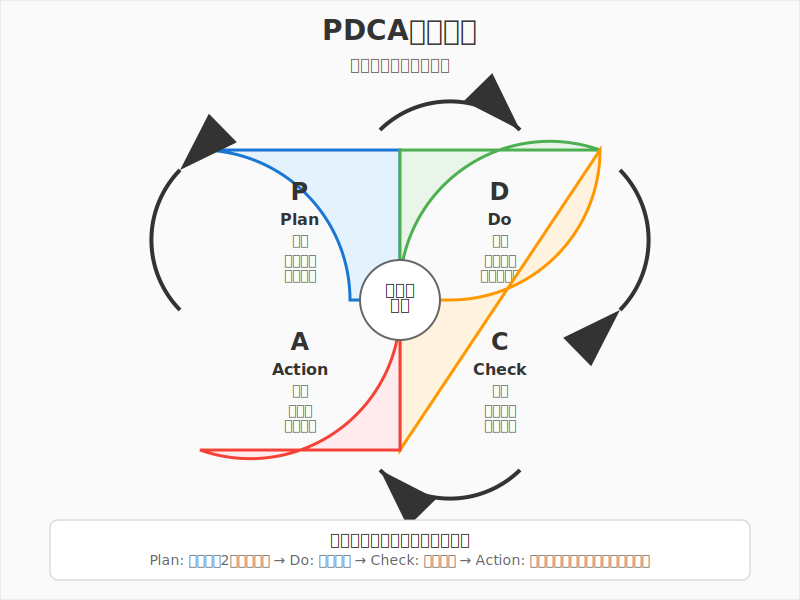

# 第8章　データで経営を改善する




**学習目標**: データドリブン経営とKPI管理の基本を習得する

---

## 8-1　数字で経営を見る

### ゲーム内データ活用の体験を振り返ろう

Supermarket Simulatorをプレイしているとき、こんなデータを確認していませんでしたか？

「今日の売上は昨日より多いかな？」
「どの商品がよく売れているだろう？」
「レジ待ち時間はどのくらいだろう？」
「利益率はどの商品が一番高いかな？」

これらすべてが**データを活用した経営判断**の基本です。勘や経験だけでなく、数字に基づいて判断することで、より良い結果を得ることができます。

### データドリブン経営とは

**データドリブン経営**とは、勘や経験だけでなく、データに基づいて意思決定を行う経営スタイルです。

#### 従来の経営 vs データドリブン経営

**従来の経営（勘と経験重視）**
```
意思決定の根拠：
- 経営者の直感
- 過去の経験
- 業界の常識
- 感覚的な判断

例：「この商品は売れそうな気がする」
→ 仕入れて販売
→ 結果：予想より売れなかった
```

**データドリブン経営**
```
意思決定の根拠：
- 売上データ
- 顧客行動データ
- 市場データ
- 実績の数値

例：「過去3ヶ月のデータで類似商品の売上が20%向上」
→ データに基づいて仕入れ量を決定
→ 結果：予測通りの売上達成
```

#### データドリブン経営のメリット

**客観的な判断**
```
感情や先入観に左右されない
事実に基づいた冷静な判断
複数の人が同じ結論に到達
```

**再現性がある**
```
成功要因が明確
同じ方法で再現可能
他の人にも伝達可能
ノウハウの蓄積
```

**継続的改善**
```
効果の測定が可能
改善点の特定
PDCA サイクルの実践
長期的な成長
```

### KPI（重要業績評価指標）とは

**KPI（Key Performance Indicator）**とは、目標達成に向けた重要な指標のことです。

#### KPIの特徴

**SMARTな指標**
```
S - Specific（具体的）
M - Measurable（測定可能）
A - Achievable（達成可能）
R - Relevant（関連性）
T - Time-bound（期限付き）

例：
悪い例：「売上を増やす」
良い例：「3ヶ月後までに月間売上を20%向上させる」
```

#### ゲーム体験でのKPI例

**売上系KPI**
```
- 日販（1日の売上）
- 客数（1日の来客数）
- 客単価（1人あたりの購入金額）
- 商品別売上ランキング

売上 = 客数 × 客単価
この関係式で売上向上の要因を分析
```

**効率系KPI**
```
- レジ待ち時間
- 商品補充回数
- 在庫回転率
- 1時間あたりの接客数

効率向上 → コスト削減 → 利益改善
```

**満足度系KPI**
```
- お客様の待ち時間
- 商品の品切れ回数
- クレーム件数
- リピート来店率

満足度向上 → 売上向上 → 長期的成長
```

### データの種類と活用方法

経営で活用できるデータには様々な種類があります。

#### 内部データ（社内で収集するデータ）

**売上・財務データ**
```
- 日次・月次売上
- 商品別売上
- 利益率
- コスト構造

活用例：
利益率の高い商品を特定
→ 重点的に販売促進
→ 全体利益の向上
```

**顧客データ**
```
- 購買履歴
- 来店頻度
- 年齢・性別
- 購買パターン

活用例：
よく買う商品の組み合わせを分析
→ セット販売やレイアウト変更
→ 客単価向上
```

**オペレーションデータ**
```
- 在庫レベル
- 作業時間
- エラー発生率
- 設備稼働率

活用例：
作業時間の分析
→ 効率的な作業手順の確立
→ 人件費削減
```

#### 外部データ（外部から取得するデータ）

**市場データ**
```
- 業界売上動向
- 競合他社の価格
- 市場シェア
- 消費者トレンド

活用例：
業界平均と自社の比較
→ 改善すべき分野の特定
→ 戦略的改善施策
```

**経済データ**
```
- 消費者物価指数
- 可処分所得
- 人口動態
- 天候情報

活用例：
天候と売上の関係分析
→ 天気予報を活用した仕入れ調整
→ 機会損失の削減
```

#### データ活用の基本プロセス

**1. データ収集**
```
必要なデータの特定
収集方法の決定
システムの構築
継続的な収集体制
```

**2. データ整理・加工**
```
データのクリーニング
統一形式への変換
欠損値の処理
分析可能な形への加工
```

**3. データ分析**
```
基本統計量の算出
トレンド分析
相関関係の発見
パターンの特定
```

**4. 洞察の発見**
```
データから読み取れる事実
改善すべき問題点
新たな機会の発見
仮説の立案
```

**5. アクション実行**
```
具体的な改善策の実施
効果の測定
継続的な改善
新たなデータの収集
```

---

## 8-2　売上分析の基本

### 売上構成分析（商品別、時間別、顧客別）

売上を様々な角度から分析することで、改善の機会を発見できます。

#### 商品別売上分析

**ABC分析の復習と活用**
```
商品分類（先月の実績）：
Aランク（売上構成比70%）：20商品
- 牛乳、パン、弁当、飲料など
- 重点管理商品

Bランク（売上構成比20%）：50商品  
- お菓子、調味料、日用品など
- 標準管理商品

Cランク（売上構成比10%）：130商品
- 季節商品、嗜好品など
- 簡易管理商品
```

**商品別分析の観点**
```
売上金額：どの商品が売上に貢献？
販売数量：どの商品がよく売れる？
利益額：どの商品が利益に貢献？
利益率：どの商品が効率的？

例：商品比較
商品A：売上100万円、利益20万円、利益率20%
商品B：売上50万円、利益20万円、利益率40%

→ 売上重視ならA、効率重視ならB
```

#### 時間別売上分析

**時間帯分析**
```
ゲーム体験例：
朝（8-11時）：30%（通勤・通学客）
昼（11-14時）：25%（ランチ客）
夕方（17-19時）：35%（帰宅客）
夜（19-21時）：10%（追加購入客）

活用方法：
- 時間帯別の人員配置最適化
- 商品陳列の時間別変更
- 特売タイミングの調整
```

**曜日別分析**
```
売上パターン例：
月曜：80（週明けで少なめ）
火曜：85
水曜：90
木曜：95
金曜：120（週末買い出し）
土曜：150（休日で最大）
日曜：130

活用方法：
- 仕入れ計画の精度向上
- シフト計画の最適化
- プロモーション日程の決定
```

**季節・月別分析**
```
季節要因の把握：
春：新生活関連商品が好調
夏：冷たい飲み物、アイス類が急増
秋：温かい商品への切り替え
冬：鍋用品、おでんなどが好調

月別トレンド：
12月：年末需要で売上最大
1月：正月明けで売上減少
3月：新生活準備で売上増加
```

#### 顧客別売上分析

**顧客セグメント分析**
```
年齢別：
10-20代：コンビニ系商品、単価低め
30-40代：ファミリー向け、まとめ買い
50代以上：品質重視、客単価高め

来店頻度別：
毎日来店：常連客、必需品中心
週2-3回：計画的買い物、単価高め
月1-2回：まとめ買い、冷凍品多め
```

**RFM分析**
```
R（Recency）：最近の購入
F（Frequency）：購入頻度
M（Monetary）：購入金額

例：顧客分類
優良客：R高、F高、M高
→ 特別サービスで維持

新規客：R高、F低、M低
→ 頻度向上の施策

休眠客：R低、F低、M低
→ 復活キャンペーン
```

### ABC分析の応用

第3章で学んだABC分析を、より深く活用する方法を学びましょう。

#### 多軸ABC分析

**売上×利益の2軸分析**
```
　　　　　売上高　　売上低
利益高　　スター　　隠れた宝石
利益低　　問題児　　撤退候補

スター：売上も利益も高い主力商品
隠れた宝石：売上は少ないが利益率が高い
問題児：売上は高いが利益が少ない
撤退候補：売上も利益も少ない
```

**戦略的活用**
```
スター商品：
- 品切れ絶対回避
- 最良の売場位置確保
- 競合価格の常時監視

隠れた宝石：
- 売場展開の拡大
- 販促強化で売上向上
- 類似商品の開発

問題児：
- 仕入価格の見直し
- 販売価格の調整
- 効率的な売場運営

撤退候補：
- 段階的な縮小
- 売場スペースの転用
- 新商品への入れ替え
```

#### 顧客別ABC分析

**顧客の価値分類**
```
Aランク顧客（上位20%）：売上の80%を占める
- VIP待遇
- 個別サービス
- 特別優待

Bランク顧客（中位30%）：売上の15%
- 標準サービス
- Aランクへの引き上げ施策

Cランク顧客（下位50%）：売上の5%
- 効率的なサービス
- 離反防止の最低限対応
```

### パレートの法則（80:20の法則）

**パレートの法則**とは、「全体の80%の結果は、20%の要因によって生み出される」という法則です。

#### ビジネスでのパレートの法則

**売上の80:20**
```
商品：上位20%の商品が売上の80%を占める
顧客：上位20%の顧客が売上の80%を占める
時間：20%の時間で80%の成果を生む
問題：20%の問題が全体の80%の影響を与える
```

**実際の分析例**
```
100商品を扱う店舗の場合：
上位20商品（20%）：売上構成比75%
中位30商品（30%）：売上構成比20%
下位50商品（50%）：売上構成比5%

→ 20商品に集中することで効率的な経営
```

#### パレートの法則の活用方法

**重点管理**
```
限られた経営資源を重要な20%に集中：

商品管理：
上位20%商品の在庫・品質を重点管理
下位80%商品は簡易管理

顧客対応：
上位20%顧客には手厚いサービス
下位80%顧客には効率的なサービス

時間配分：
重要な20%の業務に80%の時間を投入
```

**改善の優先順位**
```
問題の20%を解決すれば80%の効果：

売上向上：
上位20%商品の販促強化
→ 全体売上の大幅改善

コスト削減：
主要20%のコスト要因を改善
→ 全体コストの大幅削減

品質向上：
重要20%の品質問題を解決
→ 顧客満足度の大幅向上
```

### データの可視化

数字の羅列では見えないパターンも、グラフにすることで明確になります。

#### 基本的なグラフの種類

**棒グラフ**
```
用途：商品別売上、月別売上など
特徴：数値の大小比較が容易

例：商品別売上
牛乳　　：■■■■■■■■ 80万円
パン　　：■■■■■■ 60万円
弁当　　：■■■■■ 50万円
お菓子　：■■■ 30万円
```

**折れ線グラフ**
```
用途：時系列変化、トレンド分析
特徴：変化の傾向が分かりやすい

例：月次売上推移
1月 → 2月 → 3月 → 4月
100万 → 110万 → 105万 → 120万
```

**円グラフ**
```
用途：構成比、シェア分析
特徴：全体に占める割合が直感的

例：売上構成比
食品：60%
日用品：25%
雑貨：15%
```

**散布図**
```
用途：2つの要素の関係分析
特徴：相関関係が視覚的に理解

例：価格と売上数量の関係
価格が上がると売上数量が下がる傾向
```

#### 効果的な可視化のポイント

**目的に応じたグラフ選択**
```
比較：棒グラフ
変化：折れ線グラフ
構成：円グラフ
関係：散布図
分布：ヒストグラム
```

**見やすいデザイン**
```
シンプルな色使い
適切なタイトル
軸ラベルの明記
データソースの記載
```

**誤解を招かない表現**
```
適切な軸の範囲設定
データの偏りに注意
グラフの種類による印象の違い
数値の正確な表示
```

---

## 8-3　経営ダッシュボードの作成

### 重要指標の選定

**ダッシュボード**とは、重要な指標を一目で確認できるように整理した画面や資料のことです。

#### ダッシュボードの目的

**迅速な現状把握**
```
朝一番で昨日の業績を確認
問題の早期発見
意思決定スピードの向上
```

**関係者との情報共有**
```
スタッフ全員が目標を共有
進捗状況の見える化
チーム一体となった取り組み
```

#### 重要指標（KPI）の選び方

**バランスの取れた指標設定**
```
財務指標（結果）：
- 売上
- 利益
- 客単価

非財務指標（プロセス）：
- 顧客満足度
- 従業員満足度
- 業務効率

先行指標（未来）：
- 新規顧客数
- リピート率
- 在庫回転率

遅行指標（過去）：
- 月次売上
- 月次利益
- 年次成長率
```

#### スーパーマーケット向けダッシュボード例

**日次ダッシュボード（毎日確認）**
```
【売上関連】
今日の売上：28万円（目標30万円）
客数：140人（目標150人）
客単価：2,000円（目標2,000円）

【運営関連】
平均レジ待ち時間：2.5分（目標3分以内）
商品品切れ件数：3件（目標5件以内）
スタッフ稼働率：85%（目標80-90%）

【前日比較】
売上前日比：+5%
客数前日比：-3%
客単価前日比：+8%
```

**週次ダッシュボード（毎週確認）**
```
【売上トレンド】
今週売上：210万円（先週：200万円）
週間成長率：+5%
月間目標達成率：70%

【商品分析】
売上Top5商品とシェア
新商品の売上状況
季節商品の動向

【顧客分析】
新規客数：50人
リピート客数：450人
顧客満足度スコア：4.2/5.0
```

**月次ダッシュボード（毎月確認）**
```
【業績サマリー】
月間売上：900万円（目標：850万円）
月間利益：180万円（目標：170万円）
売上成長率：+12%（前年同月比）

【効率性指標】
在庫回転率：8.5回転
従業員一人当たり売上：60万円
売場面積当たり売上：15万円/㎡

【改善状況】
前月課題の解決状況
今月の新たな課題
来月の改善計画
```

### 可視化の原則

効果的なダッシュボードには一定の原則があります。

#### 情報の階層化

**概要 → 詳細の流れ**
```
Level 1：サマリー（一目で全体状況把握）
- 今日の売上：目標達成度
- 重要アラート：要注意事項

Level 2：分析（詳細な現状分析）
- 商品別売上内訳
- 時間帯別分析
- 前年同期比較

Level 3：詳細（具体的データ）
- 商品別詳細データ
- 顧客別詳細データ
- トランザクションログ
```

#### 視覚的分かりやすさ

**色の効果的使用**
```
緑：良好、目標達成
黄：注意、目標近い
赤：警告、目標未達成
青：中立、情報

例：売上達成度
目標100%：105% →【緑】
目標100%：95% →【黄】
目標100%：85% →【赤】
```

**数値の表現方法**
```
大きな数字：視覚的インパクト
前年比：％での表示
トレンド：矢印や折れ線グラフ
達成度：プログレスバー

例：
売上　1,280,000円
前年比　↗ +12%
目標達成度　████████░░ 85%
```

#### 更新頻度とリアルタイム性

**データの鮮度**
```
リアルタイム（随時更新）：
- 現在の売上
- 在庫状況
- レジ待ち時間

日次更新：
- 前日売上
- 昨日の顧客数
- 日別比較

週次・月次更新：
- トレンド分析
- 前年同期比較
- 目標達成度
```

### アラート機能の設計

問題の早期発見のために、自動アラート機能を設計します。

#### アラートの種類

**緊急アラート（即座に対応必要）**
```
在庫切れ：主力商品の在庫ゼロ
システム障害：POSシステムダウン
異常売上：通常の50%以下の売上

対応：即座に担当者に通知
表示：赤色で点滅表示
音声：アラーム音
```

**注意アラート（早めの対応が望ましい）**
```
売上不振：目標の80%未満
客数減少：前日比20%減
レジ混雑：平均待ち時間5分超

対応：30分以内に確認
表示：黄色で常時表示
通知：メールやアプリ通知
```

**情報アラート（参考情報）**
```
天候変化：雨予報で売上影響予想
競合情報：近隣店の特売情報
市場動向：業界ニュース

対応：1日以内に確認
表示：青色で表示
通知：日次レポートに含める
```

#### アラート基準の設定

**統計的基準**
```
過去データの分析：
平均値 ± 標準偏差の範囲外
過去90日の最低値を下回る
前年同期比で20%以上の乖離

例：客数アラート
過去30日平均：150人
標準偏差：20人
アラート基準：110人未満（平均-2σ）
```

**ビジネス基準**
```
目標値との比較：
売上目標の80%未満
利益目標の70%未満
顧客満足度スコア4.0未満

競合比較：
市場平均を20%下回る
競合店より売上が低い
業界標準に達していない
```

---

## 8-4　現実のデータ活用事例

### 事例1: セブン-イレブンのPOSデータ活用

セブン-イレブンは、POSデータの活用において業界をリードしている企業です。

#### POSデータとは

**POS（Point of Sale）データ**
```
収集内容：
- 商品名・コード
- 販売時刻
- 販売価格
- 販売数量
- 顧客属性（年齢・性別）
- 天候情報
- 地域情報

データ量：
約21,000店舗 × 1日数百件
= 年間数十億件のトランザクション
```

#### セブン-イレブンの活用方法

**単品管理の徹底**
```
商品ごとの詳細分析：
- おにぎり30種類を個別管理
- 時間帯別の売れ筋把握
- 天候による売上変動分析
- 地域別の嗜好性把握

例：おにぎりの時間帯分析
朝7-9時：ツナマヨ、鮭が人気
昼12-14時：唐揚げ、焼肉が人気
夜18-20時：赤飯、炊き込みご飯が人気
```

**仮説検証型の商品開発**
```
プロセス：
1. POSデータから仮説立案
   「健康志向が高まっている」
   
2. 仮説検証商品の投入
   「野菜を多く使った弁当」
   
3. データによる効果測定
   売上実績、顧客反応の分析
   
4. 改良・本格展開
   成功商品は全国展開
   失敗商品は早期撤退
```

**需要予測の精度向上**
```
多変量解析による予測：
- 過去の売上データ
- 曜日・季節要因
- 天候データ
- 地域イベント情報
- 競合店舗の影響

予測精度：
従来（経験ベース）：±30%
現在（データベース）：±10%

効果：
機会損失の削減：年間数十億円
廃棄ロスの削減：食品ロス50%減
```

#### 本部と店舗の連携

**データに基づく提案**
```
本部から店舗への推奨：
「明日は雨予報のため、温かい商品を20%増量発注をお勧めします」
「近隣でイベントがあるため、弁当類の発注増加をお勧めします」

店舗の判断：
データ提案 + 店舗の独自判断
= 最終的な発注量決定

結果：
単純なデータ活用より10%売上向上
```

### 事例2: Netflixのレコメンドエンジン

Netflix は、視聴データを活用して個人に最適化したコンテンツ推薦を行っています。

#### Netflixのデータ活用

**収集データ**
```
視聴行動：
- 視聴開始・停止時刻
- 一時停止・早送り回数
- 視聴完了率
- 評価・レビュー

デバイス情報：
- 視聴デバイス（TV、スマホ、PC）
- 視聴場所（GPS情報）
- 視聴時間帯

コンテンツデータ：
- ジャンル・キャスト
- 制作年・制作費
- 他ユーザーの評価
```

**レコメンドアルゴリズム**
```
協調フィルタリング：
「あなたと似た嗜好の人が高評価した作品」

コンテンツベース：
「あなたが過去に高評価した作品と類似の作品」

ハイブリッド：
複数のアルゴリズムを組み合わせ

パーソナライズ：
時間帯、デバイス、気分に応じた推薦
```

#### ビジネスへの影響

**視聴継続率の向上**
```
レコメンド精度の向上：
推薦作品の視聴開始率：80%
推薦なしの視聴開始率：40%

継続課金率：
個人最適化により解約率50%削減
新規登録者の定着率30%向上
```

**コンテンツ投資の最適化**
```
データドリブンな投資判断：
- どのジャンルが人気か？
- どの俳優が視聴率を高めるか？
- どの制作費レベルが最適か？

成功例：
「ハウス・オブ・カード」
→ データ分析により大ヒット確信
→ 2億ドルの大型投資を決断
```

### 事例3: Uberの動的価格調整システム

Uberは、需要と供給の関係をリアルタイムで分析し、価格を動的に調整しています。

#### Uberの価格調整の仕組み

**リアルタイムデータ収集**
```
需要データ：
- 配車リクエスト数
- ユーザーの位置情報
- 目的地情報
- 時間帯・曜日

供給データ：
- 利用可能なドライバー数
- ドライバーの位置情報
- 交通状況
- 天候情報
```

**サージプライシング（需要調整価格）**
```
仕組み：
需要 > 供給 → 価格上昇（サージ発動）
需要 < 供給 → 通常価格

例：金曜夜の繁華街
通常価格：1,000円
サージ価格：1.5倍 = 1,500円

効果：
- 高価格で需要を抑制
- 高収入でドライバーを誘導
- 需給バランスの自動調整
```

#### データ活用の効果

**全体最適化**
```
利用者メリット：
確実に車を確保できる
待ち時間の短縮

ドライバーメリット：
効率的な収入確保
需要の高い場所への誘導

プラットフォームメリット：
取引量の最大化
市場シェアの拡大
```

**都市交通の改善**
```
交通データの活用：
渋滞情報のリアルタイム提供
最適ルートの提案
公共交通との連携

社会的効果：
タクシー待ち時間の削減
交通渋滞の緩和
CO2排出量の削減
```

---

## 8-5　改善のPDCAサイクル

### Plan-Do-Check-Actionの実践

**PDCAサイクル**は、継続的改善のための基本的なフレームワークです。



#### PDCAサイクルの詳細

**Plan（計画）**
- 現状分析：データ収集と分析、問題点の特定
- 目標設定：具体的で測定可能な改善目標の設定
- 改善策立案：複数の解決策検討と最適案の選択

**Do（実行）**
```
改善施策の実施：
- 計画通りの実行
- 進捗状況の記録
- 問題発生時の対応

データ収集：
- 効果測定のための指標収集
- 定期的なモニタリング
- 副次的効果の記録
```

**Check（評価）**
```
効果測定：
- 目標達成度の評価
- データによる客観的分析
- 想定外の影響の確認

要因分析：
- 成功要因の特定
- 失敗要因の特定
- 改善余地の発見
```

**Action（改善）**
```
標準化：
- 成功した改善策の制度化
- 作業手順の見直し
- 教育・研修への反映

次のサイクル：
- 新たな課題の設定
- さらなる改善計画
- 継続的な向上
```

### スーパーマーケットでのPDCA実例

#### 事例：レジ待ち時間短縮プロジェクト

**Plan（計画段階）**
```
現状分析：
- 平均レジ待ち時間：5分
- ピーク時間：17-19時
- お客様クレーム：月10件

問題の原因：
- レジスタッフのスキルばらつき
- 商品バーコードの読み取りエラー
- お客様の支払い方法の多様化

目標設定：
- 平均レジ待ち時間：3分以内
- お客様クレーム：月5件以内
- 期限：3ヶ月後

改善策：
1. スタッフ研修の強化
2. セルフレジの導入
3. 商品バーコードの整備
```

**Do（実行段階）**
```
1ヶ月目：スタッフ研修
- レジ操作の標準化
- 効率的な商品スキャン方法
- お客様対応の改善

2ヶ月目：セルフレジ導入
- 2台のセルフレジ設置
- 操作方法の案内
- 有人レジとの使い分け

3ヶ月目：システム改善
- バーコード読み取り精度向上
- 決済システムの最適化
- 待ち時間表示システム導入
```

**Check（評価段階）**
```
効果測定（3ヶ月後）：
- 平均レジ待ち時間：2.8分→目標達成
- お客様クレーム：月3件→目標達成
- セルフレジ利用率：30%

副次的効果：
- スタッフの作業効率20%向上
- 人件費コスト5%削減
- 顧客満足度スコア向上

問題点：
- 高齢者のセルフレジ利用率低い
- 混雑時の案内スタッフ不足
```

**Action（改善段階）**
```
成功要因の標準化：
- 研修プログラムの全店展開
- セルフレジ導入マニュアル作成
- 待ち時間管理の仕組み化

新たな課題設定：
- 高齢者向けサポート体制構築
- ピーク時案内スタッフの効率配置
- さらなる待ち時間短縮（目標2分以内）

次のPDCAサイクル：
新たな改善計画の立案開始
```

### 仮説検証の方法

データに基づいた仮説検証により、確実な改善を実現できます。

#### 仮説設定の方法

**MECE（Mutually Exclusive and Collectively Exhaustive）**
```
漏れなく、重複なく要因を分析

例：売上低下の要因分析
1. 外部要因
   - 競合店の出店
   - 経済状況の悪化
   - 天候の影響

2. 内部要因
   - 商品力の低下
   - サービス品質の低下
   - 価格競争力の低下

3. 顧客要因
   - 顧客ニーズの変化
   - 人口動態の変化
   - ライフスタイルの変化
```

#### A/Bテストの実践

**A/Bテストの基本**
```
定義：
2つの異なるパターンを同時にテストし、
どちらが良い結果を出すかを比較する手法

例：商品陳列方法のテスト
パターンA：従来の陳列方法
パターンB：新しい陳列方法

測定期間：2週間
測定指標：商品売上、顧客の立ち寄り率
```

**有効なA/Bテストの条件**
```
1. 単一変数のテスト
   同時に複数の要素を変更しない

2. 十分なサンプル数
   統計的に有意な結果を得られる規模

3. 適切な期間設定
   季節要因や特別事情を考慮

4. 客観的な測定指標
   主観的判断ではなく数値で評価
```

#### 改善効果の測定

**定量的効果測定**
```
直接効果：
- 売上の増減
- コストの増減
- 時間の短縮

間接効果：
- 顧客満足度の向上
- 従業員満足度の向上
- ブランドイメージの向上

ROI計算：
投資対効果 = (効果額 - 投資額) ÷ 投資額 × 100

例：
投資額：100万円
年間効果：150万円
ROI = (150 - 100) ÷ 100 × 100 = 50%
```

### 継続改善の文化づくり

**改善文化**とは、組織全体で継続的に改善に取り組む意識と仕組みのことです。

#### 改善文化の要素

**全員参加**
```
経営者：
- 改善の重要性を発信
- 改善活動への資源提供
- 成功事例の表彰

管理者：
- 部下の改善活動支援
- 改善提案の評価・実行
- 改善スキルの教育

現場スタッフ：
- 日常業務での問題発見
- 改善アイデアの提案
- 改善活動への積極参加
```

**小さな改善の積み重ね**
```
カイゼンの原則：
大きな変革より小さな改善
完璧を求めず、まず実行
失敗を恐れず、学習を重視

例：レジ業務の改善
- 商品の置き方を1cm調整
- 挨拶の言葉を1つ追加
- 作業手順を1秒短縮

効果：
小さな改善×継続×全員 = 大きな変化
```

#### 改善活動の仕組み化

**提案制度**
```
改善提案の募集：
- 月間改善提案件数の目標設定
- 提案フォーマットの標準化
- 提案内容の評価基準明確化

インセンティブ：
- 採用された提案への報奨
- 改善効果に応じた表彰
- 提案者の成長機会提供
```

**改善活動のツール化**
```
改善シート：
問題点・現状・目標・対策・効果

改善事例集：
成功事例の共有・横展開

改善スケジュール：
定期的な改善活動の計画

改善効果測定：
数値による客観的評価
```

---

## 章末演習

### 演習1: KPI設定演習

あなたがSupermarket Simulatorのような店舗の店長として、効果的なKPIを設定してください。

**現在の状況**
```
店舗規模：売場面積100㎡
従業員数：8名（店長含む）
営業時間：7:00-22:00
主要顧客：近隣住民、通勤客
月間売上：1,200万円
月間利益：240万円
```

**KPI設定項目**
1. **売上系KPI（3-5個）**
   - 測定指標
   - 現状値
   - 目標値
   - 測定頻度

2. **効率系KPI（3-5個）**
   - 業務効率に関する指標
   - 測定方法
   - 改善目標

3. **顧客満足系KPI（3-5個）**
   - 顧客体験に関する指標
   - 測定手法
   - 目標水準

4. **KPI相互の関係性**
   - 各KPIの因果関係
   - 優先順位
   - バランスの考慮

### 演習2: データ分析レポート作成

以下の売上データを分析し、改善提案を含むレポートを作成してください。

**売上データ（6ヶ月分）**
```
　　　4月　　5月　　6月　　7月　　8月　　9月
売上　1000　1100　1050　1300　1400　1200（万円）
客数　5000　5200　4900　5800　6200　5400（人）

商品別売上（9月、万円）：
食品　　：720（60%）
日用品　：240（20%）
雑貨　　：120（10%）
その他　：120（10%）

時間帯別売上構成比（9月）：
朝（7-11）：20%
昼（11-17）：40%
夜（17-22）：40%
```

**分析項目**
1. **トレンド分析**
   - 売上・客数の変化傾向
   - 客単価の計算と分析
   - 季節要因の考察

2. **商品分析**
   - ABC分析の実施
   - 商品カテゴリ別の特徴
   - 改善機会の特定

3. **時間分析**
   - 時間帯別の特徴
   - ピーク時間の特定
   - 効率改善の提案

4. **総合評価と改善提案**
   - 現状の問題点
   - 具体的な改善策
   - 期待効果の予測

### 演習3: ダッシュボード設計

効果的な経営ダッシュボードを設計してください。

**要件**
- 店長が毎朝5分で状況把握できる
- 問題の早期発見が可能
- スタッフとの情報共有に活用

**設計項目**
1. **レイアウト設計**
   - 画面構成の考え方
   - 情報の優先順位
   - 視覚的な分かりやすさ

2. **表示項目**
   - 重要指標の選定
   - 数値の表示方法
   - グラフの種類選択

3. **アラート設計**
   - アラート条件の設定
   - 緊急度の分類
   - 対応手順の明確化

4. **更新頻度**
   - リアルタイム更新項目
   - 日次更新項目
   - 週次・月次更新項目

### 演習4: PDCA改善計画

具体的な改善テーマを設定して、PDCAサイクルによる改善計画を立案してください。

**改善テーマ例**
- 食品ロス削減
- 客単価向上
- 従業員満足度向上
- エネルギーコスト削減

**改善計画項目**
1. **Plan（計画）**
   - 現状分析（データ収集・分析）
   - 問題の特定と原因分析
   - 改善目標の設定
   - 具体的改善策の立案
   - 実施スケジュール

2. **Do（実行）**
   - 実施体制の構築
   - 改善策の実行手順
   - 進捗管理の方法
   - データ収集計画

3. **Check（評価）**
   - 効果測定の方法
   - 評価指標の設定
   - 分析手法の選択
   - 想定外効果の確認

4. **Action（改善）**
   - 成功要因の標準化
   - 失敗要因の対策
   - 次期改善テーマの設定
   - 継続的改善の仕組み

**提出形式**
- 改善計画書（A4で3-5ページ）
- 効果予測（定量的な目標値）
- リスク分析（予想される課題と対策）
- 実施体制（役割分担と責任者）

---

**第8章のまとめ**

- データドリブン経営により客観的で効果的な意思決定が可能
- KPIの設定により重要な指標を継続的に管理できる
- 売上分析には商品別・時間別・顧客別の多角的視点が重要
- パレートの法則により重要な20%に経営資源を集中
- ダッシュボードにより重要情報の迅速な把握と共有が実現
- 現実企業の事例から実践的なデータ活用手法を学習
- PDCAサイクルにより継続的な改善文化を構築
- 仮説検証とA/Bテストにより確実な改善効果を実現

次の第9章では、現実世界のビジネスへの応用について学びます。これまで学んだ経営学の知識を実社会でどう活かすか、将来のキャリアについて考えていきましょう。


