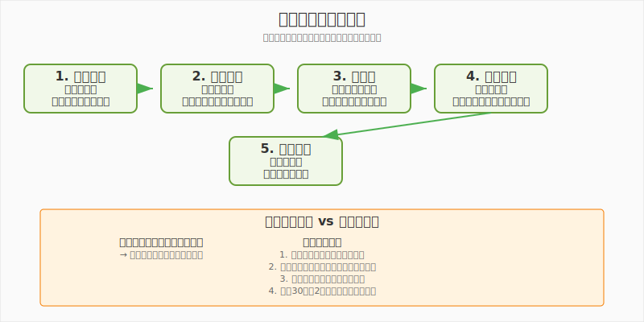

# 第9章　現実世界のビジネスへ


**学習目標**: 学習内容を実社会に応用する方法を理解する

---

## 9-1　ゲーム体験を仕事に活かす

### 学んだスキルの棚卸し

この本を通じて、あなたはSupermarket Simulatorというゲーム体験から、多くの経営スキルを身につけました。まずは、どんなスキルを習得したかを整理してみましょう。

#### 分析・判断スキル

**データ分析能力**
```
ゲーム体験：
- 売上データの確認
- 商品別売上の比較
- 時間帯別の売上変動分析

実社会での応用：
- 学校の成績データ分析
- 部活動の練習効果測定
- 家計簿の支出分析
- 将来の職場での業績分析
```

**問題発見・解決能力**
```
ゲーム体験：
- レジ待ち時間の問題発見
- 商品品切れの原因分析
- 改善策の立案と実行

実社会での応用：
- 学級の問題を見つけて解決提案
- 部活動の課題改善
- 地域の問題に対する解決アイデア
- 将来の職場での業務改善
```

#### 計画・実行スキル

**資源配分能力**
```
ゲーム体験：
- 限られた資金での商品仕入れ
- 人員配置の最適化
- 時間管理

実社会での応用：
- 限られた時間での勉強計画
- 部活動の予算管理
- イベント運営の役割分担
- 将来のプロジェクト管理
```

**投資判断能力**
```
ゲーム体験：
- 設備投資の検討
- 投資回収期間の計算
- リスクとリターンの評価

実社会での応用：
- 進路選択での費用対効果分析
- 習い事や資格取得の投資判断
- 将来の起業資金計画
- 住宅購入の投資判断
```

#### コミュニケーション・管理スキル

**顧客対応能力**
```
ゲーム体験：
- お客様の満足度向上
- 効率的なサービス提供
- 問題対応

実社会での応用：
- 友人関係での相手への配慮
- 学園祭での来場者対応
- アルバイトでの接客
- 将来の営業・サービス業務
```

**チームワーク能力**
```
ゲーム体験：
- 効率的な店舗運営
- 目標達成への取り組み
- 継続的改善

実社会での応用：
- クラス活動での協調
- 部活動でのチームワーク
- グループワークでのリーダーシップ
- 将来の組織マネジメント
```

### ビジネス思考の基本パターン

経営学を学ぶことで身についた**ビジネス思考**は、様々な場面で役立ちます。

#### 構造化思考

**問題を要素に分解して考える**



**3C分析の応用**
```
進路選択での活用：
Customer（社会のニーズ）：
どんな職業が求められているか？

Company（自分の強み）：
自分は何が得意か？何に興味があるか？

Competitor（競合）：
同じ道を目指す人はどのくらいいるか？

→ 最適な進路の発見
```

#### PDCA思考

**継続的改善の習慣**
```
勉強方法の改善例：
Plan：今月は数学の点数を20点上げる
Do：毎日1時間の問題演習を実行
Check：中間テストで効果を確認
Action：効果的だった方法を継続、
       効果が少なかった方法を変更

→ この思考パターンが身につくと、
  どんな分野でも継続的に成長できる
```

#### 数値思考

**感覚ではなく数字で判断する**
```
部活動での例：
感覚的：「最近調子が良い」
数値的：「先月より記録が5%向上」

効果の違い：
- 客観的な評価が可能
- 他の人との共有が容易
- 改善点が明確になる
- 目標設定が具体的になる
```

### 問題解決アプローチの習得

ビジネスで使われる問題解決の手法は、日常生活でも非常に有効です。

#### ロジカルシンキング

**論理的思考の基本**
```
因果関係の把握：
「なぜ？」を5回繰り返す

例：遅刻が多い
なぜ1：朝起きるのが遅いから
なぜ2：夜寝るのが遅いから
なぜ3：宿題が終わらないから
なぜ4：効率的な勉強法を知らないから
なぜ5：勉強計画を立てていないから

根本原因：勉強計画の不備
解決策：効果的な勉強計画の作成
```

#### クリティカルシンキング

**批判的思考の活用**
```
情報の評価：
- その情報は信頼できるか？
- 偏見や先入観は含まれていないか？
- 他の視点から見るとどうか？
- データや根拠はあるか？

例：「この参考書が一番良い」という情報
→ 誰が言っているか？
→ どんな根拠があるか？
→ 自分に合っているか？
→ 他の選択肢はないか？
```

#### システム思考

**全体的な視点での考察**
```
相互関係の理解：
個別の問題ではなく、全体のシステムとして捉える

例：学級の雰囲気が悪い
個別対応：問題のある人を注意
システム思考：
- コミュニケーション不足？
- 共通目標の不在？
- ルールの不明確さ？
- リーダーシップの問題？

→ 根本的な仕組みから改善
```

---

## 9-2　将来のキャリアを考える

### 経営に関わる職業の紹介

この本で学んだ経営学の知識は、様々な職業で活かすことができます。

#### 直接的に経営に関わる職業

**経営者・起業家**
```
仕事内容：
- 会社の方向性決定
- 戦略立案と実行
- 資源配分の決定
- 組織運営

必要なスキル：
- リーダーシップ
- 意思決定力
- コミュニケーション能力
- 数値分析能力

この本での関連学習：
- 成長戦略（第6章）
- 財務管理（第7章）
- データ分析（第8章）
```

**経営コンサルタント**
```
仕事内容：
- 企業の問題分析
- 改善提案の作成
- 改善実行の支援
- 業界動向の調査

必要なスキル：
- 問題発見・分析能力
- 論理的思考力
- プレゼンテーション能力
- 業界知識

この本での関連学習：
- 問題解決手法（全章）
- 競合分析（第4章）
- 改善のPDCA（第8章）
```

**プロジェクトマネージャー**
```
仕事内容：
- プロジェクト計画立案
- 進捗管理
- チーム調整
- 品質・コスト・納期管理

必要なスキル：
- 計画立案能力
- チームマネジメント
- リスク管理
- コミュニケーション能力

この本での関連学習：
- 投資判断（第6章）
- 資源配分（第1章）
- 効率化（第2章）
```

#### 間接的に経営に関わる職業

**営業・マーケティング**
```
仕事内容：
- 市場分析
- 顧客ニーズ把握
- 販売戦略立案
- 顧客関係構築

関連学習：
- 顧客満足度管理（第5章）
- 価格戦略（第4章）
- 市場分析（第3章）
```

**データアナリスト**
```
仕事内容：
- データ収集・分析
- レポート作成
- 改善提案
- システム設計

関連学習：
- データ分析（第8章）
- KPI管理（第8章）
- 需要予測（第3章）
```

**人事・組織開発**
```
仕事内容：
- 採用・育成
- 組織設計
- 人事制度企画
- 労務管理

関連学習：
- チーム管理（第2章）
- 投資判断（第6章）
- 継続改善（第8章）
```

**財務・会計**
```
仕事内容：
- 財務諸表作成
- 予算管理
- 資金調達
- 投資分析

関連学習：
- 財務三表（第7章）
- 投資回収（第6章）
- 数値分析（第8章）
```

### 起業という選択肢

将来の選択肢として、自分で会社を作る「起業」もあります。

#### 起業のメリット・デメリット

**メリット**
```
自由度：
- 自分のアイデアを実現
- 働き方を自分で決められる
- 創造的な仕事ができる

成長性：
- 成功時のリターンが大きい
- 急速な個人成長
- 社会への大きな影響

やりがい：
- 社会問題の解決
- 新しい価値の創造
- チーム作りの楽しさ
```

**デメリット・リスク**
```
不安定性：
- 収入の不安定さ
- 失敗のリスク
- 長時間労働

責任：
- 全ての決定責任
- 従業員への責任
- 投資家への責任

困難：
- 資金調達の困難
- 人材確保の困難
- 競争の激しさ
```

#### 起業に必要な準備

**スキルの習得**
```
この本で学んだスキル：
- 事業計画の立案
- 財務管理
- マーケティング
- データ分析

追加で必要なスキル：
- 専門技術（IT、製造など）
- 法律・税務知識
- 資金調達のノウハウ
- ネットワーキング
```

**段階的なアプローチ**
```
中学・高校時代：
- 基礎知識の習得
- 小さなビジネス体験
- 様々な業界の研究

大学時代：
- 専門知識の深化
- インターンシップ
- 学生起業の体験

社会人経験：
- 実務経験の蓄積
- 業界知識の習得
- 人脈の構築

独立・起業：
- 十分な準備での起業
- 成功確率の向上
```

### 必要なスキルと学習方法

#### 21世紀に求められるスキル

**テクニカルスキル（専門技術）**
```
IT・デジタル：
- プログラミング
- データ分析
- AI・機械学習
- ウェブデザイン

ビジネス：
- 会計・財務
- マーケティング
- プロジェクト管理
- 語学（英語）

学習方法：
- オンライン講座
- 専門学校・大学
- 資格取得
- 実践経験
```

**ヒューマンスキル（対人能力）**
```
コミュニケーション：
- プレゼンテーション
- 交渉力
- チームワーク
- リーダーシップ

思考力：
- 論理的思考
- 創造性
- 批判的思考
- 問題解決力

学習方法：
- 実際の体験
- ディベート・討論
- グループワーク
- ボランティア活動
```

**コンセプチュアルスキル（概念化能力）**
```
戦略思考：
- システム思考
- 長期視点
- 抽象化能力
- イノベーション

学習方法：
- 読書・研究
- ケーススタディ
- 異分野の学習
- 実践での試行錯誤
```

#### 効果的な学習戦略

**学習の優先順位**
```
1. 基礎スキル（中学・高校）
   - 論理的思考
   - 基礎的なコミュニケーション
   - 数学・科学の基礎

2. 専門スキル（大学・社会人）
   - 業界知識
   - 技術スキル
   - 資格取得

3. 応用スキル（実務経験）
   - マネジメント
   - 戦略立案
   - イノベーション
```

**継続学習の重要性**
```
変化の速い時代：
- 技術の急速な進歩
- ビジネスモデルの変化
- 社会情勢の変動

対応方法：
- 生涯学習の習慣
- 新しい分野への挑戦
- ネットワークからの学習
- 失敗からの学習
```

---

## 9-3　中学生からできるビジネス体験

### 学園祭での店舗運営

学園祭は、経営学で学んだ知識を実践する絶好の機会です。

#### 企画立案段階

**市場調査**
```
ターゲット分析：
- 来場者：生徒、保護者、地域住民
- 年齢層：小学生から高齢者まで
- 予算：一人500-1,000円程度

競合分析：
- 他クラスの出店内容
- 学校周辺の飲食店
- 価格帯の調査

ニーズ調査：
- アンケート調査
- 昨年の人気店舗分析
- 時間帯別の需要予測
```

**商品・サービス企画**
```
差別化ポイント：
- 他にはない独自性
- 手作りの温かさ
- 健康・安全への配慮

例：オリジナル弁当
特徴：地元食材使用、健康志向
価格：400円（競合より50円安）
数量：1日100個限定
```

#### 事業計画の作成

**収支計画**
```
売上計画：
弁当400円 × 100個 × 2日 = 80,000円

費用計画：
材料費：40,000円（売上の50%）
容器代：8,000円
人件費：0円（クラスメート協力）
その他：2,000円
合計費用：50,000円

利益：80,000円 - 50,000円 = 30,000円
利益率：37.5%
```

**リスク管理**
```
想定リスク：
- 天候による来場者減少
- 材料の調達ミス
- 食品の衛生問題
- 競合店との価格競争

対策：
- 屋内販売場所の確保
- 複数業者からの調達
- 保健所基準の遵守
- 品質での差別化
```

#### 実行段階での学習

**オペレーション管理**
```
役割分担：
- 調理担当：3名
- 販売担当：2名
- 会計担当：1名
- 呼び込み担当：2名

品質管理：
- 衛生基準の徹底
- 味の統一
- 温度管理

顧客対応：
- 笑顔での接客
- 待ち時間の短縮
- クレーム対応手順
```

### フリーマーケット出店

個人でも参加できるフリーマーケットは、商売の基本を学ぶ良い機会です。

#### 商品選定と価格設定

**商品の選び方**
```
仕入れ方法：
- 家にある不用品
- 手作り商品
- 安く仕入れた商品

選定基準：
- 需要がありそうか？
- 適正な価格で売れるか？
- 持ち運びしやすいか？
- 傷みにくいか？

例：手作りアクセサリー
材料費：200円
販売価格：500円
粗利：300円（粗利率60%）
```

**価格戦略**
```
価格設定の考え方：
- 材料費の3倍程度
- 同類商品の市場価格
- 顧客の支払い意思額

価格交渉への対応：
- 最低価格の事前設定
- 複数購入割引
- 時間帯による値下げ
```

#### 販売スキルの向上

**接客技術**
```
基本的な接客：
- 明るい挨拶
- 商品説明
- 顧客の質問への回答
- 感謝の気持ち

売上向上テクニック：
- 商品の魅力的な陳列
- 使用シーンの提案
- 関連商品の提案
- リピート購入の促進
```

**データ収集と分析**
```
記録する項目：
- 時間帯別の来客数
- 商品別の売上
- 顧客の年齢・性別
- 値下げ交渉の頻度

分析と改善：
- 人気商品の特徴分析
- 効果的な販売時間帯
- 価格設定の妥当性
- 次回への改善点
```

### オンラインでの販売体験

インターネットを活用した販売も、現代的なビジネス体験として有効です。

#### プラットフォーム選択

**主要なプラットフォーム**
```
メルカリ：
特徴：個人間取引、手軽
手数料：10%
ユーザー：若年層中心

ヤフオク：
特徴：オークション形式
手数料：10%（落札者負担もあり）
ユーザー：幅広い年齢層

BASE・STORES：
特徴：本格的なネットショップ
手数料：3-5%
ユーザー：ビジネス志向
```

#### 商品企画・撮影・説明

**魅力的な商品ページ作成**
```
写真撮影のコツ：
- 明るい自然光での撮影
- 複数角度からの撮影
- 使用イメージが分かる写真
- 傷や汚れも正直に撮影

商品説明文：
- 正確なサイズ・重量
- 材質・機能の詳細
- 使用感・注意点
- 発送方法・日数

価格設定：
- 競合商品の価格調査
- 送料の考慮
- プラットフォーム手数料の計算
```

#### 顧客対応・発送業務

**オンライン接客**
```
メッセージ対応：
- 迅速な返信（24時間以内）
- 丁寧で分かりやすい説明
- 購入意欲を高める情報提供

トラブル対応：
- 商品の不備への対応
- 配送トラブルの解決
- 返品・交換の適切な処理

発送業務：
- 丁寧な梱包
- 迅速な発送
- 追跡番号の連絡
- 到着確認とお礼
```

---

## 9-4　継続学習のすすめ

### 推薦図書リスト

この本で経営学の基礎を学んだあなたが、さらに深く学習するための書籍を紹介します。

#### 初級者向け（中学・高校生）

**経営学の基礎**
```
「もし高校野球の女子マネージャーがドラッカーの『マネジメント』を読んだら」
- 著者：岩崎夏海
- 特徴：小説形式で経営学を学習
- 学べること：マネジメントの基本概念

「MBA生産性をあげる100の基本」
- 著者：戸塚隆将
- 特徴：実践的なビジネススキル
- 学べること：仕事の効率化、問題解決
```

**数字・分析思考**
```
「数字に強くなる」
- 著者：畑村洋太郎
- 特徴：数字の見方・使い方
- 学べること：データ分析の基礎

「統計学が最強の学問である」
- 著者：西内啓
- 特徴：統計学の実用性
- 学べること：データに基づく判断
```

#### 中級者向け（大学生・社会人）

**戦略・マーケティング**
```
「競争戦略論」
- 著者：マイケル・ポーター
- 特徴：競争戦略の古典
- 学べること：業界分析、差別化戦略

「ブルー・オーシャン戦略」
- 著者：W・チャン・キム、レネ・モボルニュ
- 特徴：新市場創造の戦略
- 学べること：イノベーション思考
```

**組織・リーダーシップ**
```
「7つの習慣」
- 著者：スティーブン・R・コヴィー
- 特徴：個人の効果性向上
- 学べること：リーダーシップ、時間管理

「学習する組織」
- 著者：ピーター・センゲ
- 特徴：組織学習の理論
- 学べること：チーム作り、継続改善
```

### 有用なWebサイト・アプリ

#### 学習サイト

**無料学習プラットフォーム**
```
Coursera：
- 世界の大学の講義を受講
- ビジネス、経済学のコース充実
- 英語が基本（日本語字幕あり）

edX：
- MIT、ハーバードなどの講義
- 経営学、データサイエンス
- 修了証の取得可能

Khan Academy：
- 基礎から体系的に学習
- 数学、経済学の基礎
- 完全無料
```

**日本語学習サイト**
```
グロービス学び放題：
- ビジネススキルの動画学習
- 月額1,980円
- 実践的な内容

Schoo：
- ライブ授業形式
- ビジネス、IT、デザイン
- 無料コンテンツも豊富
```

#### 情報収集サイト

**ビジネスニュース**
```
日経電子版：
- 経済・ビジネスニュース
- 企業分析記事
- 市場動向

東洋経済オンライン：
- 企業・業界分析
- 経営者インタビュー
- トレンド解説

NewsPicks：
- ビジネスパーソン向け
- 専門家の解説付き
- ディスカッション機能
```

**データ・統計**
```
総務省統計局：
- 政府の公式統計
- 人口、経済指標
- 無料で利用可能

Google Analytics：
- ウェブサイトアクセス解析
- データ分析の実践
- 無料利用可能
```

#### 実践アプリ

**家計管理・投資**
```
マネーフォワード：
- 家計簿の自動化
- 投資管理
- 資産分析

楽天証券アプリ：
- 投資シミュレーション
- 市場データ確認
- 投資の基礎学習
```

**プロジェクト管理**
```
Trello：
- タスク管理
- プロジェクト進捗管理
- チーム協働

Notion：
- ノート・データベース
- プロジェクト管理
- 情報整理
```

### 学習コミュニティへの参加

#### オンラインコミュニティ

**学習サークル**
```
起業サークル：
- 大学の起業サークル
- 学生起業家との交流
- ビジネスコンテスト参加

読書会：
- ビジネス書の読書会
- ディスカッション参加
- 様々な視点の学習
```

**専門コミュニティ**
```
業界別コミュニティ：
- IT、金融、製造業など
- 現役職業人との交流
- 業界の最新動向

スキル別コミュニティ：
- データ分析、マーケティング
- スキル向上のための情報交換
- 実践的なノウハウ共有
```

#### オフラインイベント

**セミナー・勉強会**
```
ビジネススクール主催：
- 無料セミナー参加
- 体験授業
- 経営者講演

商工会議所イベント：
- 地域企業との交流
- 経営者体験談
- 地域課題の議論
```

**インターンシップ・職場体験**
```
企業インターンシップ：
- 実際の業務体験
- 現場での学習
- メンター制度

職場見学：
- 様々な業界の見学
- 働く人との対話
- キャリア選択の参考
```

---

## 9-5　社会課題とビジネス

### 社会問題を解決するビジネス

現代のビジネスは、利益追求だけでなく、社会課題の解決も重要な役割になっています。

#### 社会課題の例

**環境問題**
```
課題：
- 地球温暖化
- プラスチック廃棄物
- 食品ロス
- 資源枯渇

ビジネス解決例：
- 再生可能エネルギー事業
- リサイクル・アップサイクル事業
- フードシェアリングサービス
- シェアリングエコノミー
```

**高齢化社会**
```
課題：
- 介護人材不足
- 孤立・孤独
- 健康管理
- 移動手段

ビジネス解決例：
- 介護ロボット開発
- 高齢者向けSNS
- ヘルステック事業
- 高齢者向け移動サービス
```

**地域格差**
```
課題：
- 地方の人口減少
- 地域経済の衰退
- 教育機会の格差
- 医療アクセスの格差

ビジネス解決例：
- 地方創生事業
- オンライン教育サービス
- 遠隔医療システム
- 地域産品のEC事業
```

#### ソーシャルビジネスの特徴

**従来のビジネス vs ソーシャルビジネス**
```
従来のビジネス：
目的：利益最大化
指標：売上、利益率、株価
関心：株主の利益

ソーシャルビジネス：
目的：社会課題解決 + 利益確保
指標：社会的インパクト + 財務指標
関心：全ステークホルダーの利益
```

**トリプルボトムライン**
```
3P（People, Planet, Profit）：
People（人）：社会的価値
Planet（地球）：環境価値
Profit（利益）：経済価値

全てをバランス良く追求する経営
```

### 持続可能な経営

**SDGs（持続可能な開発目標）**の観点から経営を考えることが重要になっています。

#### SDGsとビジネス

**17の目標とビジネス機会**
```
1. 貧困をなくそう
→ マイクロファイナンス、包摂的ビジネス

2. 飢餓をゼロに
→ 農業技術、食品流通改善

3. すべての人に健康と福祉を
→ ヘルスケア、予防医学

4. 質の高い教育をみんなに
→ EdTech、オンライン教育

5. ジェンダー平等を実現しよう
→ 女性活躍支援、ダイバーシティ

（中略）

17. パートナーシップで目標を達成しよう
→ 企業連携、官民連携
```

#### ESG経営

**ESG（Environment, Social, Governance）**
```
Environment（環境）：
- 温室効果ガス削減
- 再生可能エネルギー利用
- 廃棄物削減
- 生物多様性保護

Social（社会）：
- 人権尊重
- 労働環境改善
- 地域社会貢献
- 消費者保護

Governance（統治）：
- 透明性の確保
- コンプライアンス
- リスク管理
- ステークホルダー対話
```

### 次世代のビジネスモデル

技術の進歩と社会変化により、新しいビジネスモデルが生まれています。

#### デジタル変革

**DX（Digital Transformation）**
```
従来のビジネス：
- 物理的な店舗・オフィス
- 人による作業
- 紙による情報管理

DX後のビジネス：
- オンライン・バーチャル
- AIによる自動化
- データによる意思決定

例：小売業のDX
- 実店舗 + ECサイト
- AIによる需要予測
- 個人化された商品推薦
```

#### シェアリングエコノミー

**所有から利用へ**
```
従来：個人が商品を所有
新モデル：必要な時だけ利用

例：
- カーシェア（車）
- Airbnb（宿泊）
- WeWork（オフィス）
- メルカリ（中古品）

メリット：
- 資源の有効活用
- 初期コストの削減
- 環境負荷の軽減
```

#### サブスクリプション

**一回購入から継続利用へ**
```
従来：商品を一回購入
新モデル：月額・年額で継続利用

例：
- Netflix（動画配信）
- Spotify（音楽配信）
- Adobe（ソフトウェア）
- 食材宅配サービス

メリット：
- 顧客の利用障壁が低い
- 安定した収益確保
- 顧客との継続関係
```

#### プラットフォームビジネス

**仲介によるネットワーク効果**
```
従来：企業が直接顧客にサービス提供
新モデル：プラットフォームが多数の提供者と利用者を仲介

例：
- Amazon（販売者と購入者）
- Uber（ドライバーと利用者）
- YouTube（配信者と視聴者）

特徴：
- ネットワーク効果（利用者増→価値向上）
- 高い収益性
- 市場支配力の確立
```

### 中学生ができる社会貢献

将来の大きなビジネスの前に、今できる小さな社会貢献から始めましょう。

#### 身近な課題解決

**学校での課題解決**
```
問題発見：
- 学校生活での不便さ
- クラスメートの困りごと
- 学習環境の改善点

解決アプローチ：
- 生徒会での提案
- 先生への改善提案
- 自主的な改善活動

例：
問題：図書館の本が見つけにくい
解決：検索システムの提案
効果：利用者の満足度向上
```

**地域での活動**
```
地域課題の発見：
- 高齢者の困りごと
- 環境問題
- 商店街の活性化

貢献方法：
- ボランティア活動
- 地域イベントの企画
- 情報発信・啓発活動

例：
課題：高齢者のスマホ操作
活動：スマホ教室の開催
学び：教育事業の可能性発見
```

#### 小さなビジネスでの社会貢献

**チャリティ要素を含むビジネス**
```
フリーマーケット：
売上の一部を寄付

手作り商品販売：
環境に優しい材料使用

サービス提供：
高齢者向け安価サービス

効果：
- 社会課題への関心向上
- ビジネスと社会貢献の両立体験
- 将来のキャリア選択への影響
```

---

## 章末演習

### 演習1: キャリアプラン作成

あなたの将来のキャリアプランを作成してください。

**Step 1: 自己分析**
```
興味・関心：
- 好きなこと、楽しいと感じること
- 時間を忘れて取り組めること
- 将来やってみたいこと

強み・スキル：
- 得意なこと
- 人から褒められること
- この本で身についたスキル

価値観：
- 大切にしたいこと
- 譲れないもの
- 理想的な働き方
```

**Step 2: 環境分析**
```
社会動向：
- 将来有望な業界
- 技術の進歩による変化
- 社会課題とビジネス機会

家族・環境：
- 家族の期待・希望
- 経済的な制約
- 地域の特性
```

**Step 3: 目標設定**
```
長期目標（10年後）：
- どんな仕事をしているか
- どんな生活をしているか
- 社会にどう貢献しているか

中期目標（5年後）：
- 大学での専攻
- 身につけたいスキル
- 経験したいこと

短期目標（3年後）：
- 高校での学習内容
- 課外活動
- 進路選択
```

### 演習2: ビジネスアイデア企画書作成

社会課題を解決するビジネスアイデアを企画してください。

**企画書構成**
```
1. 課題設定
   - 解決したい社会課題
   - 課題の現状と影響
   - なぜその課題を選んだか

2. ソリューション
   - 具体的な解決方法
   - 従来の解決方法との違い
   - 独自性・優位性

3. ターゲット
   - 主要顧客
   - 市場規模
   - 顧客のニーズ

4. ビジネスモデル
   - 収益の仕組み
   - 価格設定
   - 販売方法

5. 実現可能性
   - 必要なリソース
   - 想定される課題
   - 成功要因
```

**例：高齢者向けスマートフォン教室**
```
課題：高齢者のデジタル格差
解決策：分かりやすい教育サービス
ターゲット：60歳以上の高齢者
収益：教室参加費、教材販売
実現性：低コスト、高い社会需要
```

### 演習3: 学園祭出店計画

この本で学んだ知識を活用して、学園祭での出店計画を立ててください。

**計画項目**
```
1. 市場調査
   - ターゲット顧客分析
   - 競合調査
   - 需要予測

2. 商品・サービス企画
   - 提供内容
   - 差別化ポイント
   - 価格設定

3. 事業計画
   - 売上計画
   - 費用計画
   - 利益予測

4. 運営計画
   - 役割分担
   - スケジュール
   - 品質管理

5. マーケティング
   - 宣伝方法
   - 販売促進
   - 顧客対応

6. リスク管理
   - 想定リスク
   - 対策方法
   - 緊急時対応
```

### 演習4: 学習継続プラン

この本で学んだ内容をさらに深めるための学習プランを作成してください。

**学習プラン項目**
```
1. 短期学習目標（6ヶ月）
   - 読みたい本（3-5冊）
   - 参加したいイベント
   - 身につけたいスキル

2. 中期学習目標（2年）
   - 取得したい資格
   - 経験したい活動
   - 深めたい分野

3. 学習方法
   - 読書計画
   - オンライン学習
   - 実践体験

4. 学習環境
   - 学習コミュニティ参加
   - メンター・相談相手
   - 学習記録方法

5. 成果測定
   - 学習進捗の確認方法
   - 成果の評価基準
   - 振り返りのタイミング
```

---

**第9章のまとめ**

- ゲーム体験で身につけたスキルは実社会で幅広く活用できる
- 経営に関わる職業は多様で、様々なキャリア選択肢がある
- 起業は大きな可能性とリスクを持つ選択肢の一つ
- 中学生からできるビジネス体験で実践的学習が可能
- 継続学習により知識とスキルを発展させることが重要
- 現代ビジネスは社会課題解決との両立が求められる
- 小さな社会貢献から始めて将来の大きな影響力につなげる

**全書のまとめ**

この本を通じて、あなたはSupermarket Simulatorというゲーム体験から、経営学の基本的な考え方と実践的なスキルを学びました。

1. **第1章**で経営の基本概念を理解
2. **第2章**で効率的なオペレーション設計を学習
3. **第3章**で需要予測と在庫管理の重要性を習得
4. **第4章**で戦略的な価格設定の方法を理解
5. **第5章**で顧客満足度管理の手法を学習
6. **第6章**で成長戦略と投資判断の基準を習得
7. **第7章**で財務管理とお金の流れを理解
8. **第8章**でデータを活用した経営改善を学習
9. **第9章**で実社会への応用方法を考察

これらの知識は、将来どんな職業に就いても、どんな人生を歩んでも、必ず役に立つ基礎的な思考力です。経営学は、限られた資源で最大の成果を生み出す方法論であり、それは仕事だけでなく、日常生活のあらゆる場面で活用できます。

あなたがこの本で学んだことを活かして、自分自身の人生を効果的に「経営」し、社会に価値を提供する人になることを願っています。そして、いつか大きなビジネスを通じて、世界をより良い場所にすることに貢献してくれることを期待しています。

最後に、学習は一度で終わりではありません。この本で学んだ基礎を土台として、継続的に新しいことを学び、実践し、成長し続けてください。あなたの未来には無限の可能性があります。

